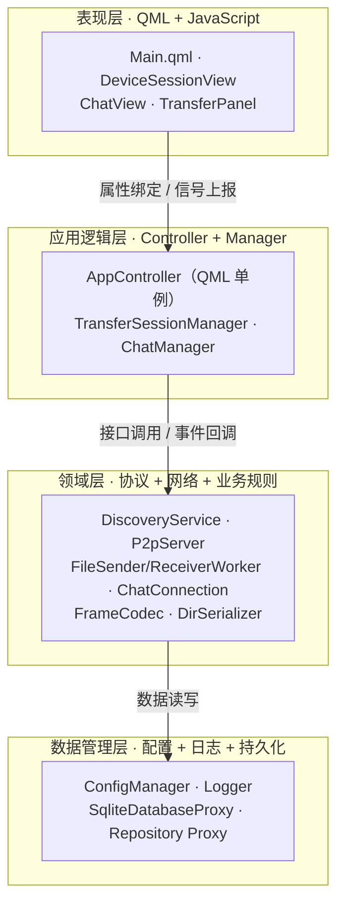
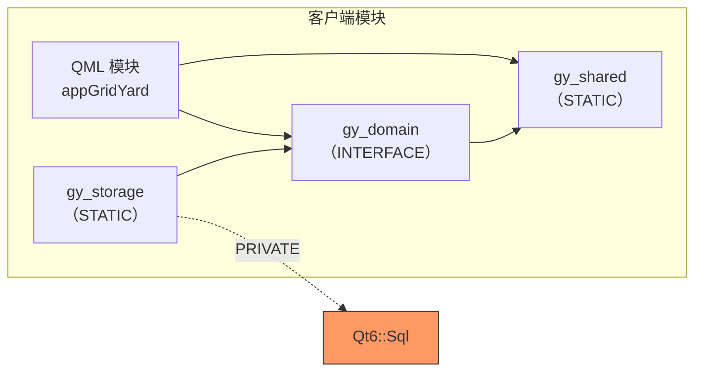
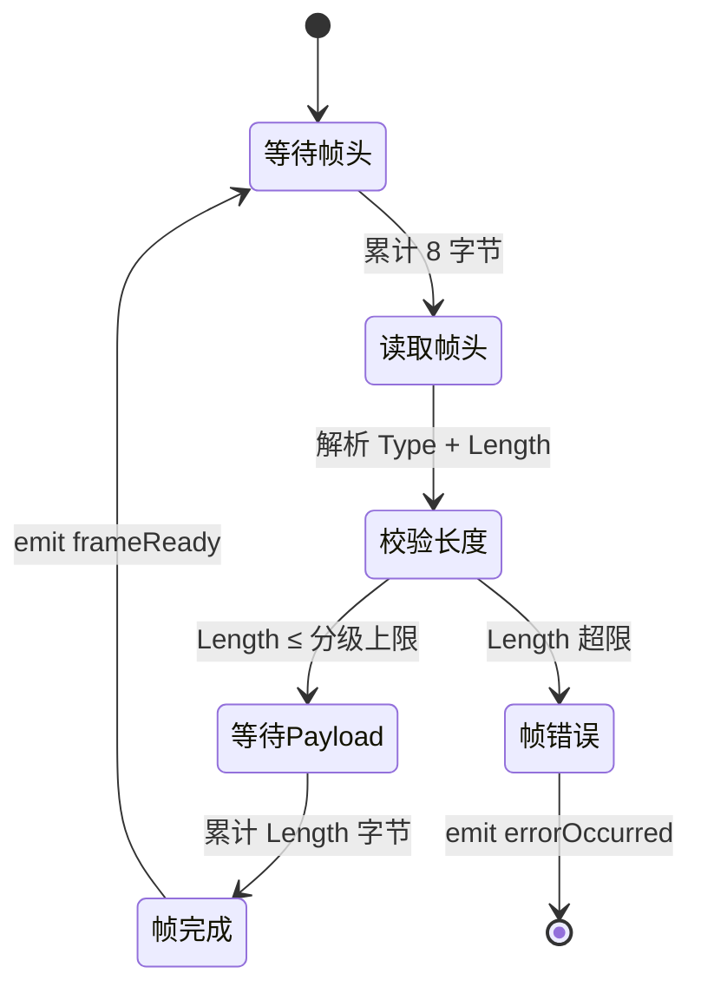
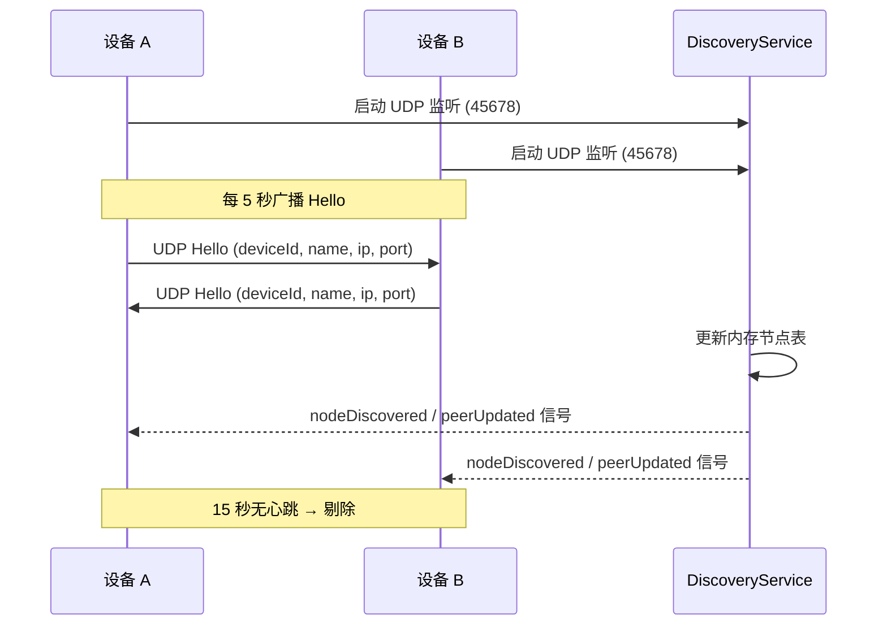
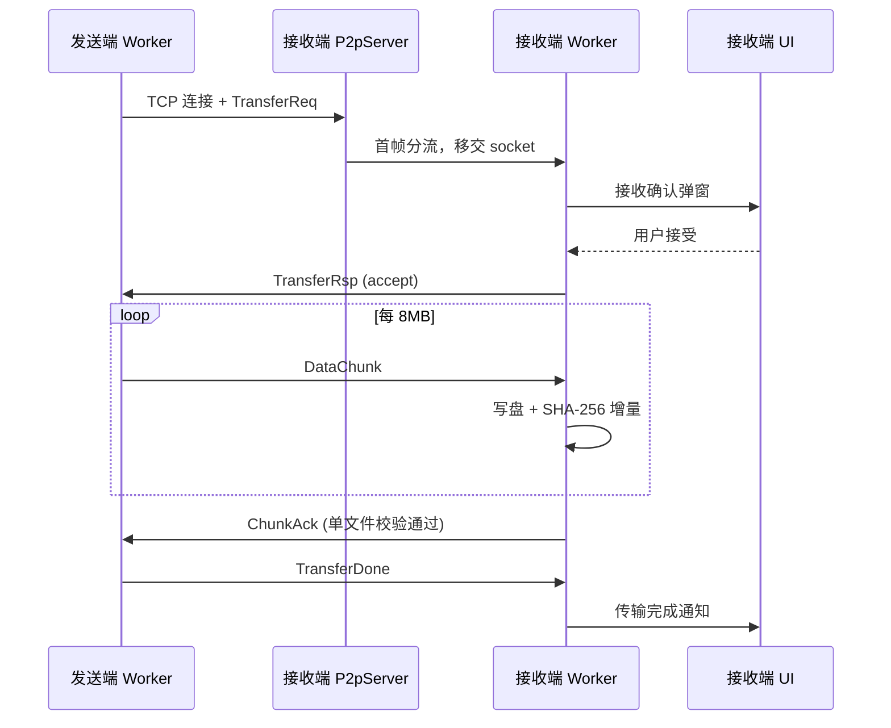

# GridYard — 鸽邮

> 局域网 P2P 文件传输与即时通讯桌面应用，全程零公网流量。

当前版本：v6.3.0

GridYard 是一款面向局域网场景的桌面文件传输与聊天工具。两台接入同一网段的电脑即可互相发现、直传文件与文件夹、收发文本消息，无需任何中心服务器、账号登录或公网连接。基于自研 TLV 二进制协议与 Qt6 全 QML 技术栈构建，支持多文件目录传输、SHA-256 完整性校验、断线自动重连与本地历史持久化。

---

## 核心特性

- **即时设备发现**：UDP 广播自动发现同网段设备，5 秒心跳保活，15 秒离线剔除，支持多网卡环境
- **P2P 直传**：TCP 点对点传输，单文件与多文件目录均支持，8MB 分块 + SHA-256 校验 + 背压控制
- **在线聊天**：复用 P2P 通道的文本消息收发，连接复用、消息去重、断线按需重连
- **协议自研**：TLV 二进制帧格式，按 Type 分级 Payload 上限，粘包/半包状态机，协议版本协商
- **本地持久化**：SQLite 存储聊天记录、传输历史与设备目录，重启可查；WAL 模式 + 异步写入不阻塞主链路
- **零公网**：全程局域网通信，不依赖云服务、账号体系或第三方中转
- **跨文件系统安全**：路径穿越防护、磁盘空间预检、零字节文件处理、重名避让

---

## 技术栈

| 类别 | 选型 |
|:-----|:-----|
| 语言标准 | C++23 |
| GUI 框架 | Qt 6.11（全 QML 路线） |
| 构建系统 | CMake 4.2.3 + Ninja |
| 编译器 | GCC 16.1 |
| 数据库 | SQLite（WAL 模式） |
| 加密校验 | SHA-256（QCryptographicHash） |
| 部署平台 | Manjaro Linux |

---

## 快速开始

### 环境要求

- GCC 15+ 或 Clang 17+
- CMake 4.2.3+
- Qt 6.5+（含 Quick、Network、QuickControls2、Sql 模块）
- Ninja（推荐）
- Linux 桌面门户（KDE 使用 `xdg-desktop-portal-kde`）

### 构建与运行

```bash
git clone <仓库地址>
cd GridYard

# 配置（在 src 目录下）
cmake -S src -B src/build-ninja -G Ninja -DCMAKE_BUILD_TYPE=Debug

# 编译
cmake --build src/build-ninja -j

# 运行
./src/build-ninja/client/appGridYard
```

### 运行测试

```bash
ctest --test-dir src/build-ninja --output-on-failure
```

### 本机双实例测试

```bash
# 实例 A（接收端）
./src/build-ninja/client/appGridYard --port 35100 --name "接收端" &

# 实例 B（发送端）
./src/build-ninja/client/appGridYard --port 35101 --name "发送端" &
```

**命令行参数**

| 参数 | 说明 | 默认值 |
|:-----|:-----|:-------|
| `--port <port>` | TCP 监听端口 | 35100 |
| `--name <name>` | 设备显示名称 | 系统主机名 |
| `--config <path>` | 配置文件路径 | 系统默认路径 |

---

## 系统架构

GridYard 采用四层架构，职责严格隔离：



**分层约束**

- QML 禁止直接访问 `QSqlDatabase`、SQL 或文件系统
- 应用层只依赖 Repository 接口，不感知 SQLite 实现细节
- SQL 仅存在于 `client/storage/*.cpp`，所有参数通过 `bindValue()` 绑定
- 数据库不可用时自动降级为无历史模式，P2P 主链路不受影响

**模块依赖方向**



`Qt6::Sql` 通过 PRIVATE 链接隔离，不传播到 QML 模块或网络 Worker。

---

## 协议设计

GridYard 使用自研 TLV（Type-Length-Value）二进制协议：

| 字段 | 长度 | 字节序 | 说明 |
|:-----|:-----|:-------|:-----|
| Type | 4 字节 | 大端 | 帧类型码 |
| Length | 4 字节 | 大端 | Payload 字节数 |
| Payload | Length 字节 | — | 业务数据 |

**帧处理状态机**



| Type 码 | 方向 | 用途 |
|:--------|:-----|:-----|
| 0x0001 | UDP | 设备 Hello / 心跳 |
| 0x0101 | TCP | 传输握手请求 |
| 0x0102 | TCP | 握手响应 |
| 0x0201 | TCP | 文件数据分块 |
| 0x0301 | TCP | 单文件完成确认 |
| 0x0302 | TCP | 全部传输完成 |
| 0x0401 | TCP | 取消传输 |
| 0x0501 | TCP | 聊天文本消息 |
| 0x0502 | TCP | 聊天送达回执 |

Payload 按 Type 分级限制：控制帧 1MB，数据帧 256MB，聊天帧 64KB。协议版本字段（`kProtocolVersion = 0x0100`）支持主版本不兼容拒绝与次版本安全降级。

---

## 设备发现与传输流程

**设备发现时序**



**文件传输时序**



---

## 仓库目录结构

```text
GridYard/
├── README.md
├── doc/
│   ├── diagrams/                        # UML 类图、组件图、序列图
│   │   └── rendered/                    # PNG/SVG 导出
│   ├── dev-manual/
│   │   ├── 规格与设计/                   # 技术规格、架构设计
│   │   ├── 开发心得/                     # 踩坑记录、开发手册
│   │   └── 测试与部署/                   # 测试与打包指南
│   ├── plans/                           # 阶段开发计划
│   ├── spec/                            # 业务逻辑、需求规格
│   └── api-docs/                        # 模块 API 文档
├── scripts/                             # 辅助脚本
└── src/
    ├── CMakeLists.txt                   # 顶层 CMake
    ├── shared/                          # 共用静态库 gy_shared
    │   ├── protocol.h                   # TLV 协议 Type 码与常量
    │   ├── data_types.h                 # PeerInfo / FileEntry / TransferSession
    │   ├── chat_message.{h,cpp}         # 聊天消息 JSON 编解码
    │   └── frame_codec.{h,cpp}          # TLV 帧编解码（粘包状态机）
    ├── client/
    │   ├── main.cpp                     # 程序入口
    │   ├── Main.qml                     # QML 根窗口
    │   ├── core/                        # 应用逻辑层
    │   │   ├── app_controller.{h,cpp}   # 全局控制器（QML 单例）
    │   │   ├── config_manager.{h,cpp}   # 配置管理（QSettings）
    │   │   ├── transfer_session_manager.{h,cpp}
    │   │   ├── chat_manager.{h,cpp}     # 聊天连接与内存会话
    │   │   ├── chat_message_model.{h,cpp}
    │   │   ├── application_paths.{h,cpp}
    │   │   ├── dir_serializer.{h,cpp}   # 目录遍历 + SHA-256
    │   │   └── logger.{h,cpp}           # 日志拦截器
    │   ├── network/                     # 网络层
    │   │   ├── discovery_service.{h,cpp}    # UDP 设备发现
    │   │   ├── p2p_server.{h,cpp}           # TCP 服务器（首帧分流）
    │   │   ├── chat_connection.{h,cpp}      # 聊天 TCP 连接
    │   │   ├── file_sender_worker.{h,cpp}  # 发送 Worker（后台线程）
    │   │   └── file_receiver_worker.{h,cpp}# 接收 Worker（后台线程）
    │   ├── domain/                      # 领域层（Repository 端口）
    │   │   ├── history_records.h        # PeerRecord / MessageRecord / TransferRecord
    │   │   └── history_repositories.h   # IDevice/Message/TransferHistory Repository
    │   ├── storage/                     # 基础设施层（SQLite Proxy）
    │   │   ├── sqlite_database_proxy.{h,cpp}  # 连接、WAL、事务
    │   │   ├── sqlite_device_proxy.{h,cpp}    # 设备目录 Data Mapper
    │   │   ├── sqlite_message_proxy.{h,cpp}   # 聊天消息 Data Mapper
    │   │   ├── migration_runner.{h,cpp}       # Schema 版本迁移
    │   │   └── database_worker.{h,cpp}        # 异步数据库线程
    │   ├── ui/                          # QML 界面组件
    │   │   ├── DeviceCard.qml
    │   │   ├── PeerListView.qml
    │   │   ├── DeviceSessionView.qml
    │   │   ├── ChatView.qml             # 聊天气泡视图
    │   │   ├── SettingsDialog.qml
    │   │   ├── AcceptDialog.qml
    │   │   ├── TransferPanel.qml
    │   │   ├── TransferTaskCard.qml
    │   │   └── FileTypeIcon.qml
    │   └── utils/                       # QML 工具模块
    │       ├── Style.js                 # 样式常量
    │       └── FormatUtils.js           # 格式化工具
    ├── server/                          # V2 服务端（规划中）
    └── tests/                           # 单元测试与集成测试
        ├── test_frame_codec.cpp
        ├── test_chat_message.cpp
        ├── test_chat_manager.cpp
        ├── test_discovery.cpp
        ├── test_file_transfer.cpp
        ├── test_session_manager.cpp
        ├── test_transfer.cpp
        ├── test_config_manager.cpp
        ├── test_edge_cases.cpp
        ├── test_integration.cpp
        ├── test_storage_database.cpp
        ├── test_storage_device.cpp
        └── test_storage_message.cpp
```

---

## 关键设计决策

| 决策 | 选择 | 理由 |
|:-----|:-----|:-----|
| 通信模型 | P2P 直连 | 局域网场景无需中转，避免单点故障与公网依赖 |
| 协议格式 | TLV 二进制 | 比 JSON 紧凑，天然支持粘包状态机 |
| 多线程模型 | Worker-Object + moveToThread | 避免 QThread::run 重写，信号槽跨线程安全 |
| 数据库访问 | Repository 端口 + Data Mapper | 应用层不感知 SQL，便于测试与未来替换 |
| 接收线程 | 每连接独立 QThread | 写盘与 SHA-256 不阻塞 UI |
| 界面技术 | 全 QML | 声明式绑定，C++ 只暴露状态入口 |
| 配置存储 | QSettings | 跨平台原生配置 API |

---

## 性能与限制

| 指标 | 数值 |
|:-----|:-----|
| 单 chunk 大小 | 8 MB |
| 最大帧载荷 | 256 MB（数据帧）/ 1 MB（控制帧） |
| 心跳间隔 | 5 秒 |
| 离线剔除 | 15 秒无心跳 |
| 发现节流 | 30 秒（相同设备快照） |
| 数据库模式 | WAL，synchronous=NORMAL，busy_timeout=5000ms |
| 聊天消息上限 | 4000 字符 / 64 KB Payload |

---

## 文档索引

| 文档 | 路径 |
|:-----|:-----|
| 需求规格 | `doc/spec/鸽邮(GridYard)——技术需求与系统设计规格说明书.md` |
| 架构设计 | `doc/spec/鸽邮(GridYard)——V1.0架构设计与V2.0演进说明书.md` |
| 业务逻辑 | `doc/spec/GridYard业务逻辑说明.md` |
| 团队开发手册 | `doc/dev-manual/开发心得/鸽邮(GridYard)——团队开发者手册.md` |
| 开发心得 | `doc/dev-manual/开发心得/开发心得_从架构设计到踩坑记录.md` |
| Stage 6 数据层设计 | `doc/dev-manual/规格与设计/GridYard_Stage6_本地数据层设计.md` |
| 模块 API 文档 | `doc/api-docs/` |
| UML 图 | `doc/diagrams/` |

---

## 团队

| 成员 | 职责 |
|:-----|:----|
| 高扬 | 架构设计、协议层、CMake、打包部署、阶段验收 |
| 冯春霖 | 网络传输、Worker 实现、聊天连接、性能调优 |
| 杜若贤 | QML 界面、UI 组件、测试用例、文档与 UML |

---

## 许可证

本项目为课程作业，版权归开发团队所有，保留所有权利。详情见 [LICENSE](./LICENSE)。
