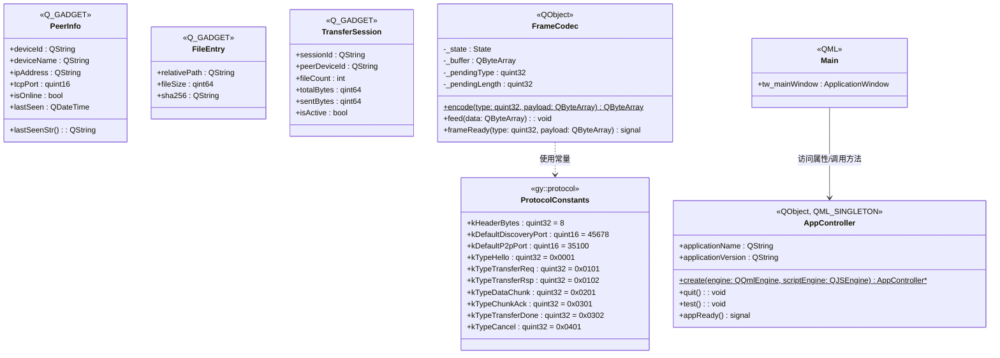

# GridYard 类图（Stage 1 当前状态）

## 说明

- **ProtocolConstants**：`gy::protocol` 命名空间中的协议常量（7 个 Type 码 + 端口 + 帧头长度）
- **PeerInfo**：Q_GADGET 值类型，局域网在线节点描述
- **FileEntry**：Q_GADGET 值类型，文件元数据（Stage 1 新增）
- **TransferSession**：Q_GADGET 值类型，传输会话状态（Stage 1 新增）
- **FrameCodec**：TLV 帧编解码器，含粘包/半包状态机（Stage 1 实现）
- **AppController**：QML_SINGLETON 单例，QML 与 C++ 通信的桥梁
- **Main.qml**：根窗口，通过 AppController 访问 C++ 功能
