# GridYard 类图（Stage 4.4 完成）

```mermaid
classDiagram
    %% 共享层（shared/）
    class ProtocolConstants {
        <<gy::protocol>>
        +kHeaderBytes : quint32 = 8
        +kDefaultDiscoveryPort : quint16 = 45678
        +kDefaultP2pPort : quint16 = 35100
        +kTypeHello : quint32 = 0x0001
        +kTypeTransferReq : quint32 = 0x0101
        +kTypeTransferRsp : quint32 = 0x0102
        +kTypeDataChunk : quint32 = 0x0201
        +kTypeChunkAck : quint32 = 0x0301
        +kTypeTransferDone : quint32 = 0x0302
        +kTypeCancel : quint32 = 0x0401
    }

    class PeerInfo {
        <<Q_GADGET>>
        +deviceId : QString
        +deviceName : QString
        +ipAddress : QString
        +tcpPort : quint16
        +isOnline : bool
        +lastSeen : QDateTime
        +lastSeenStr() : QString
    }

    class FileEntry {
        <<Q_GADGET>>
        +relativePath : QString
        +fileSize : qint64
        +sha256 : QString
    }

    class TransferSession {
        <<Q_GADGET>>
        +sessionId : QString
        +peerDeviceId : QString
        +fileCount : int
        +totalBytes : qint64
        +sentBytes : qint64
        +isActive : bool
    }

    class FrameCodec {
        <<QObject>>
        -_state : State
        -_buffer : QByteArray
        -_pendingType : quint32
        -_pendingLength : quint32
        +encode(type: quint32, payload: QByteArray)$ QByteArray
        +feed(data: QByteArray) : void
        +frameReady(type: quint32, payload: QByteArray) signal
    }

    %% 客户端层（client/）
    class ConfigManager {
        <<QObject, QML_SINGLETON>>
        +deviceId : QString
        +deviceName : QString
        +receivePath : QString
        +tcpPort : quint16
        +localIp : QString
        +create(engine: QQmlEngine, scriptEngine: QJSEngine)$ ConfigManager*
        +setDeviceName(name: QString) : void
        +setReceivePath(path: QString) : void
        +setTcpPort(port: quint16) : void
        +refreshLocalIp() : void
        +openFolder(path: QString) : void
        +deviceNameChanged() signal
        +receivePathChanged() signal
        +tcpPortChanged() signal
        +localIpChanged() signal
    }

    class DiscoveryService {
        <<QObject>>
        +peers : QVariantList
        +sendHelloPacket() : void
        +onDatagramReceived() : void
        +pruneOfflineNodes() : void
        +refresh() : void
        +peersChanged() signal
        +nodeDiscovered(deviceId: QString) signal
        +nodeExpired(deviceId: QString) signal
    }

    class AppController {
        <<QObject, QML_SINGLETON>>
        +applicationName : QString
        +applicationVersion : QString
        +discovery : DiscoveryService*
        +create(engine: QQmlEngine, scriptEngine: QJSEngine)$ AppController*
        +quit() : void
        +test() : void
        +appReady() signal
    }

    class TransferSessionManager {
        <<QObject, QML_SINGLETON>>
        +sessions : QVariantList
        -_sendWorkers : QHash~QString, FileSenderWorker*~
        +create(engine: QQmlEngine, scriptEngine: QJSEngine)$ TransferSessionManager*
        +createSendSession(deviceId, filePath) : void
        +acceptReceiveSession(sessionId) : void
        +rejectReceiveSession(sessionId) : void
        +cancelSession(sessionId) : void
        +sessionsChanged() signal
        +receiveRequestReceived(sessionId, senderName, fileName, fileSize, totalFiles, totalBytes) signal
        +transferCompleted(sessionId, fileName, filePath) signal
    }

    class P2pServer {
        <<QObject>>
        +start() : bool
        +stop() : void
        +isListening() : bool
        +transferRequestReceived(worker, senderName, fileName, fileSize, totalFiles, totalBytes) signal
    }

    class DirSerializer {
        <<gy>>
        +serialize(path: QString)$ QList~FileItem~
        +computeSha256(filePath: QString)$ QString
        -traverseDir(basePath, currentPath, result)$ void
    }

    class FileItem {
        <<gy>>
        +relativePath : QString
        +sizeBytes : qint64
        +sha256 : QString
    }

    class FileSenderWorker {
        <<QObject>>
        -_socket : QTcpSocket*
        -_codec : FrameCodec*
        -_file : QFile
        -_timeoutTimer : QTimer*
        -_rootPath : QString
        -_sessionId : QString
        -_totalBytes : qint64
        -_bytesSent : qint64
        -_fileList : QList~FileItem~
        -_currentFileIndex : int
        -_currentFileBytesSent : qint64
        +startTransfer(host, port, path) : void
        +cancel() : void
        -openNextFile() : bool
        -sendTransferDone() : void
        +progressChanged(bytesSent, totalBytes) signal
        +transferFinished(success, errorMsg) signal
        +requestAccepted() signal
        +requestRejected(reason) signal
    }

    class FileReceiverWorker {
        <<QObject>>
        -_socket : QTcpSocket*
        -_codec : FrameCodec*
        -_file : QFile
        -_timeoutTimer : QTimer*
        -_sessionId : QString
        -_senderName : QString
        -_totalFiles : int
        -_totalBytes : qint64
        -_fileList : QList~FileItem~
        -_currentFileIndex : int
        -_fileName : QString
        -_fileSize : qint64
        -_bytesReceived : qint64
        -_receivePath : QString
        +acceptTransfer() : void
        +rejectTransfer(reason) : void
        +setReceivePath(path: QString) : void
        +sessionId() : QString
        +fileName() : QString
        +transferRequestReceived(senderName, fileName, fileSize, totalFiles, totalBytes) signal
        +progressChanged(bytesReceived, totalBytes) signal
        +transferFinished(success, errorMsg) signal
    }

    class Main {
        <<QML>>
        +tw_mainWindow : ApplicationWindow
    }

    class DeviceCard {
        <<QML>>
        +deviceId : string
        +deviceName : string
        +ipAddress : string
        +isOnline : bool
        +cardClicked(deviceId) signal
        +fileDropped(deviceId, filePath) signal
    }

    class PeerListView {
        <<QML>>
        +deviceSelected(deviceId) signal
        +fileDropped(deviceId, filePath) signal
    }

    class TransferPanel {
        <<QML>>
    }

    class TransferTaskCard {
        <<QML>>
        +sessionId : string
        +taskType : string
        +taskName : string
        +status : string
        +progress : int
    }

    %% 关系
    DirSerializer --> FileItem : 生成
    FileSenderWorker --> DirSerializer : 使用
    FileSenderWorker --> FileItem : 管理列表
    FrameCodec ..> ProtocolConstants : 使用常量
    ConfigManager ..> ProtocolConstants : 使用默认端口
    Main --> AppController : 访问属性/调用方法
    Main --> TransferSessionManager : 调用方法
    PeerListView --> DeviceCard : 包含
    TransferPanel --> TransferTaskCard : 包含
    TransferSessionManager --> FileSenderWorker : 管理
    TransferSessionManager --> FileReceiverWorker : 管理
    P2pServer --> FileReceiverWorker : 创建
```

## 说明

- **ProtocolConstants**：`gy::protocol` 命名空间中的协议常量（7 个 Type 码 + 端口 + 帧头长度）
- **PeerInfo**：Q_GADGET 值类型，局域网在线节点描述
- **FileEntry**：Q_GADGET 值类型，文件元数据（Stage 1 新增）
- **TransferSession**：Q_GADGET 值类型，传输会话状态（Stage 1 新增）
- **FrameCodec**：TLV 帧编解码器，含粘包/半包状态机（Stage 1 实现）
- **ConfigManager**：QML_SINGLETON 单例，应用配置管理器（Stage 2 新增，Stage 3 添加 localIp/openFolder）
- **DiscoveryService**：UDP 广播发现服务（Stage 2 新增，Stage 3 添加 refresh 方法）
- **AppController**：QML_SINGLETON 单例，QML 与 C++ 通信的桥梁
- **TransferSessionManager**：QML_SINGLETON 单例，传输会话管理（Stage 3 新增，含 cancelSession）
- **P2pServer**：TCP 服务器，监听入站连接（Stage 3 新增）
- **DirSerializer**：目录序列化工具，递归遍历目录生成 FileItem 列表并计算 SHA-256（Stage 4 新增）
- **FileItem**：文件条目信息结构体，含相对路径、大小、SHA-256（Stage 4 新增）
- **FileSenderWorker**：文件发送 Worker-Object（Stage 3 新增，Stage 4 支持多文件/目录传输 + 超时检测）
- **FileReceiverWorker**：文件接收 Worker-Object（Stage 3 新增，Stage 4 支持多文件接收 + SHA-256 校验 + 超时检测）
- **Main.qml**：根窗口，支持拖拽传输和完成通知
- **DeviceCard.qml**：设备卡片，支持拖拽文件
- **PeerListView.qml**：设备列表，支持拖拽信号传递
- **TransferPanel.qml**：传输面板，显示任务列表
- **TransferTaskCard.qml**：传输任务卡片，支持取消按钮
