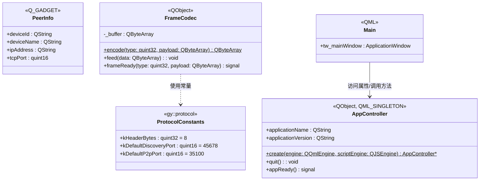

# GridYard 类图（Stage 0 当前状态）

## 说明

- **ProtocolConstants**：`gy::protocol` 命名空间中的协议常量（kHeaderBytes、端口等）
- **PeerInfo**：Q_GADGET 值类型，用于 QML 端通过 Q_PROPERTY MEMBER 访问
- **FrameCodec**：TLV 帧编解码器，Stage 0 为空实现
- **AppController**：QML_SINGLETON 单例，QML 与 C++ 通信的桥梁
- **Main.qml**：根窗口，通过 AppController 访问 C++ 功能
