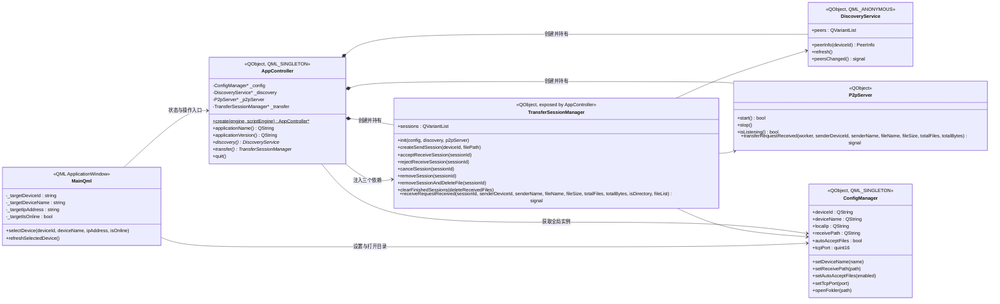
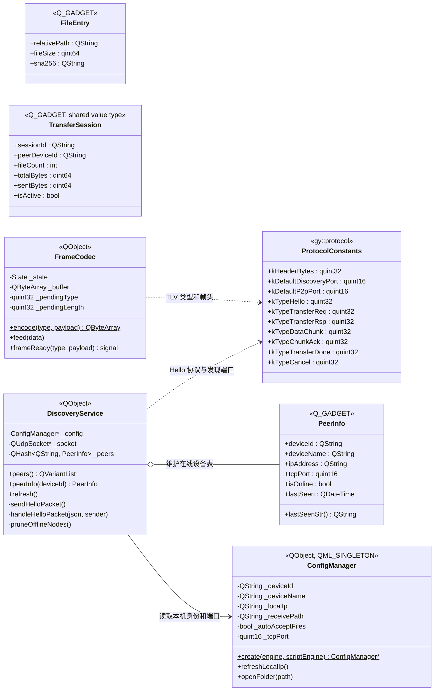
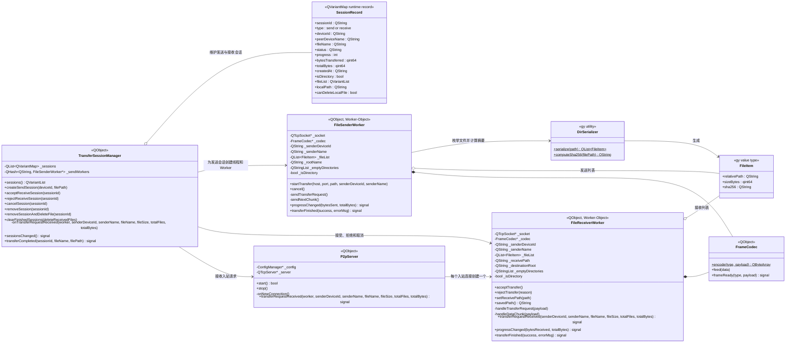
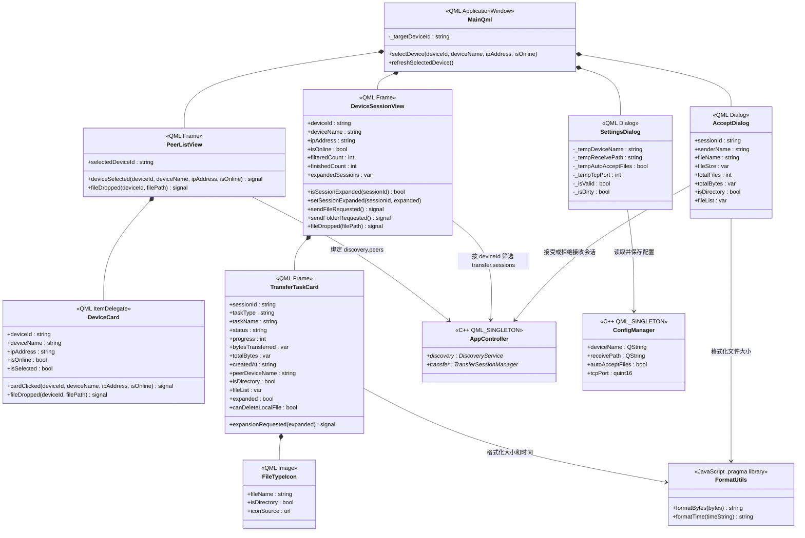
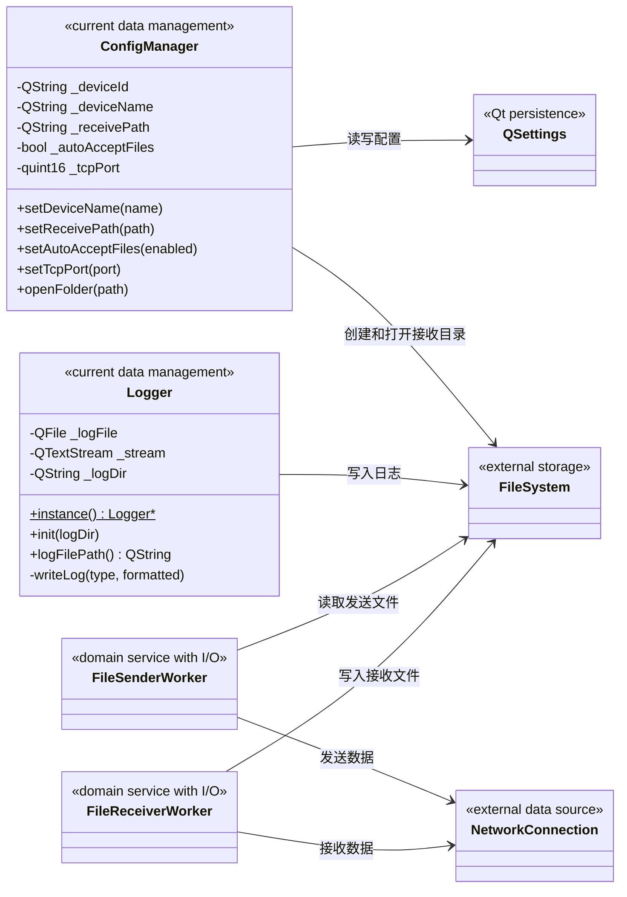

# GridYard 分层类图（v4.14.0 当前架构）

当前客户端以表现层、应用逻辑层、领域层和数据管理层为目标。为避免所有类挤在一张图中，本文件按职责拆成多张类图。

## 1. 应用逻辑层与上下层边界



`AppController` 是客户端组装点。`TransferSessionManager` 不是 QML 单例，而是由 `AppController.transfer` 暴露给页面。

## 2. 领域层：共享数据与设备发现



`FileEntry` 和 `TransferSession` 是共享值类型。当前运行中的界面会话由 `TransferSessionManager` 内部的 `QVariantMap` 列表维护，尚未直接使用共享层 `TransferSession`。

## 3. 领域层：文件传输运行时



发送请求携带 `senderDeviceId`、当前设备别名、顶层目录名和空目录列表。接收端把 `senderDeviceId` 保存为运行时会话的 `deviceId`，并在配置的接收目录下创建唯一目标路径，因此设备改名、出现同名设备或接收重名文件夹时，任务归属和落盘结果仍然明确。

## 4. QML 表现层组件



主窗口只保存当前选中设备的信息。左侧 `PeerListView` 负责选择设备，右侧 `DeviceSessionView` 根据稳定的 `deviceId` 筛选会话记录。`FileTypeIcon` 根据文件名和目录标记选择项目内置 SVG，`FormatUtils` 只提供无状态展示格式化，动画继续由 QML 声明。

## 5. 数据管理层现状



当前数据管理职责已经存在，但没有形成独立的 `data/` 模块。配置和日志相对独立，文件与网络访问仍和传输领域过程混在 Worker 中，因此只能算基本符合四层要求。

## 6. 分层关系小结

```text
表现层
  -> 应用逻辑层
  -> 领域层
  -> 数据管理层与外部资源
```

- QML 负责页面、交互和状态展示，不直接操作网络与文件系统。
- `AppController` 负责组装后端对象，并作为 QML 访问主要业务能力的入口。
- `TransferSessionManager` 负责会话生命周期和界面状态，不直接执行文件收发。
- Worker 负责 TCP 收发、文件读写、超时和摘要校验。
- `FrameCodec` 与协议常量位于共享层，可供后续服务端复用。
- 数据管理层尚未完全独立，后续持久化功能应通过仓储接口接入应用逻辑层。
