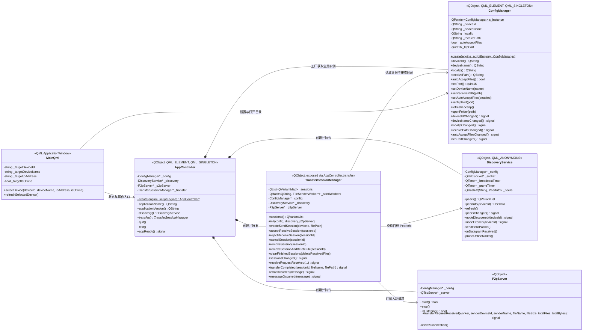
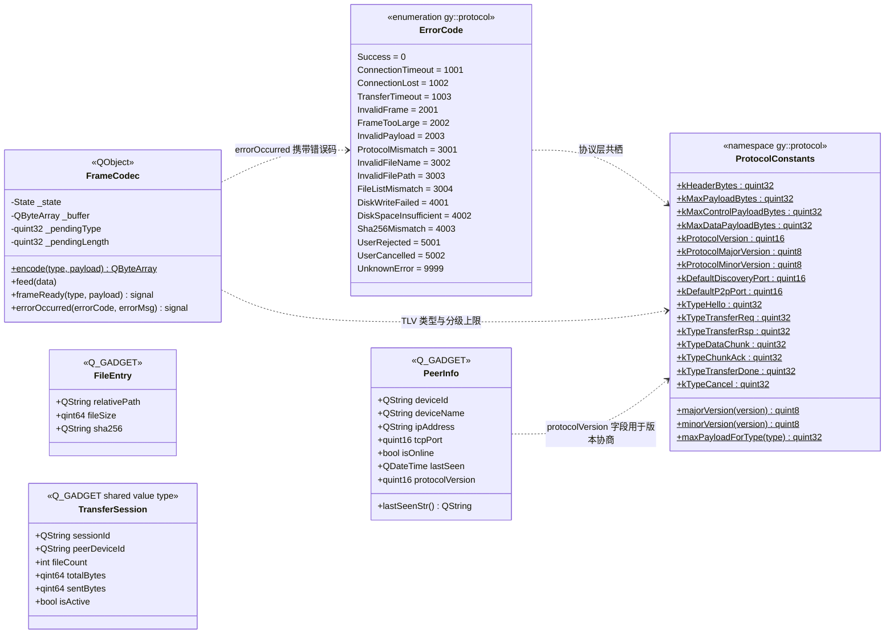
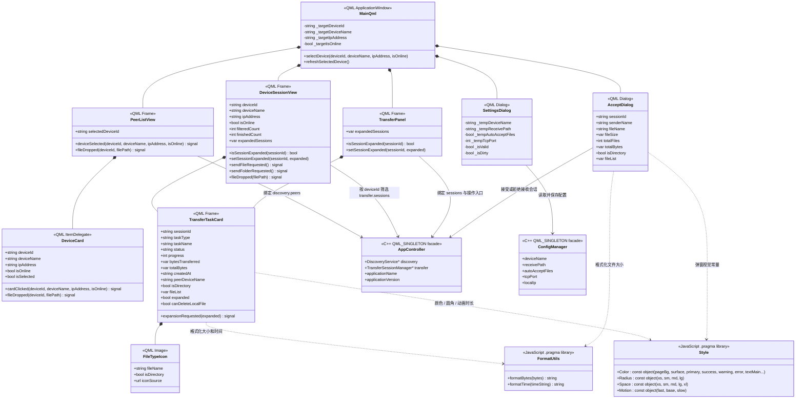
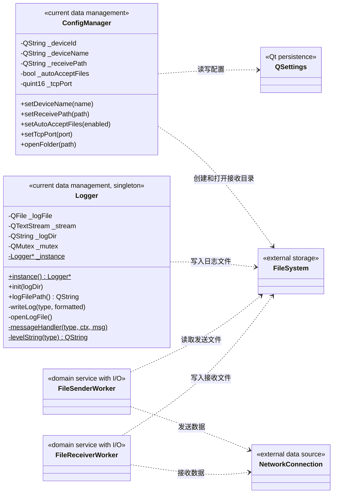

# GridYard 分层类图（v4.16.0 当前架构）

本图按"表现层 / 应用逻辑层 / 领域层 / 数据管理层"四层架构组织，每张子图聚焦一个职责切面，标注 Qt 注册方式、可见性与多重性，作为各阶段编码实现的契约参考，并便于后续服务端复用。

> 关系图例：`*--` 组合（生命周期强拥有） / `o--` 聚合（弱拥有） / `-->` 关联（持久引用） / `..>` 依赖（瞬时使用） / `--|>` 继承。

---

## 1. 应用逻辑层与上下层边界



`AppController` 是客户端组装点。`ConfigManager` 通过 Qt 工厂方法 `create()` 维护静态 `QPointer`，保证 QML 单例与 C++ 内 `AppController::_config` 引用的是同一实例，避免设置写入后信号不刷新。`TransferSessionManager` 不是 QML 单例，而是由 `AppController.transfer` 暴露给页面。

---

## 2. 领域层（一）：协议契约与共享值类型



`ProtocolConstants` 与 `ErrorCode` 同属 `gy::protocol` 命名空间，是整个传输链路的协议契约层。`FrameCodec::feed()` 在解码过程中按 `maxPayloadForType()` 校验载荷大小：控制帧（Hello / TransferReq / TransferRsp / ChunkAck / TransferDone / Cancel）上限 1MB，数据帧（DataChunk）上限 256MB，超限时通过 `errorOccurred` 抛出 `FrameTooLarge`。`PeerInfo::protocolVersion` 从对端 Hello 包解析得到，主版本不一致即拒绝会话，次版本差异允许安全降级。

`FileEntry` 与 `TransferSession` 是共享值类型，当前运行时使用 `QVariantMap` 持有会话状态，`TransferSession` POD 留作后续服务端或仓储层复用。

---

## 3. 领域层（二）：文件传输运行时与线程模型

```mermaid
classDiagram
    direction LR

    class TransferSessionManager {
        <<QObject>>
        -QList~QVariantMap~ _sessions
        -QHash~QString, FileSenderWorker*~ _sendWorkers
        +createSendSession(deviceId, filePath)
        +acceptReceiveSession(sessionId)
        +rejectReceiveSession(sessionId)
        +cancelSession(sessionId)
        -onTransferRequestReceived(worker, senderDeviceId, senderName, fileName, fileSize, totalFiles, totalBytes)
        -deleteReceivedFile(session) bool
    }

    class SessionRecord {
        <<QVariantMap runtime record>>
        +sessionId : QString
        +type : "send" | "receive"
        +deviceId : QString
        +peerDeviceName : QString
        +senderName : QString
        +filePath : QString
        +fileName : QString
        +fileSize : qint64
        +totalFiles : int
        +totalBytes : qint64
        +bytesTransferred : qint64
        +progress : int
        +status : QString
        +isDirectory : bool
        +fileList : QVariantList
        +errorCode : quint16
        +errorMsg : QString
        +createdAt : QString
        +localPath : QString
        +canDeleteLocalFile : bool
        +worker : FileReceiverWorker*
    }

    class P2pServer {
        <<QObject>>
        -ConfigManager* _config
        -QTcpServer* _server
        +start() bool
        +stop()
        -onNewConnection()
        +transferRequestReceived(worker, senderDeviceId, senderName, fileName, fileSize, totalFiles, totalBytes) signal
    }

    class FileSenderWorker {
        <<QObject, Worker-Object>>
        -QTcpSocket* _socket
        -FrameCodec* _codec
        -QFile _file
        -QTimer* _timeoutTimer
        -QString _rootPath
        -QString _sessionId
        -QString _senderDeviceId
        -QString _senderName
        -QString _rootName
        -QStringList _emptyDirectories
        -QList~gy::FileItem~ _fileList
        -int _currentFileIndex
        -qint64 _currentFileBytesSent
        -qint64 _totalBytes
        -qint64 _bytesSent
        -int _sendChunkCount
        -bool _isDirectory
        -bool _transferActive
        -bool _waitingForFileAck
        -bool _sendScheduled
        +startTransfer(host, port, path, senderDeviceId, senderName)
        +cancel()
        -sendTransferRequest()
        -sendNextChunk()
        -scheduleNextChunk()
        -openNextFile() bool
        -sendTransferDone()
        -sendCancel(reason)
        -cleanup()
        -onReadyRead()
        -onDisconnected()
        -onFrameReady(type, payload)
        -onTimeout()
        -onBytesWritten(bytes)
        +progressChanged(bytesSent, totalBytes) signal
        +transferFinished(success, errorCode, errorMsg) signal
        +requestAccepted() signal
        +requestRejected(reason) signal
    }

    class FileReceiverWorker {
        <<QObject, Worker-Object>>
        -QTcpSocket* _socket
        -FrameCodec* _codec
        -QFile _file
        -QTimer* _timeoutTimer
        -QCryptographicHash* _hash
        -QString _sessionId
        -QString _senderDeviceId
        -QString _senderName
        -QString _displayName
        -QString _rootName
        -QStringList _emptyDirectories
        -QList~gy::FileItem~ _fileList
        -QString _receivePath
        -QString _destinationRoot
        -QString _singleFilePath
        -int _totalFiles
        -qint64 _totalBytes
        -int _currentFileIndex
        -QString _fileName
        -qint64 _fileSize
        -qint64 _bytesReceived
        -qint64 _totalBytesReceived
        -int _receiveChunkCount
        -bool _waitingForUserConfirm
        -bool _transferActive
        -bool _isDirectory
        +initialize()
        +acceptTransfer()
        +rejectTransfer(reason)
        +setReceivePath(path)
        +sessionId() QString
        +senderDeviceId() QString
        +senderName() QString
        +fileName() QString
        +fileSize() qint64
        +isDirectory() bool
        +filePaths() QStringList
        +savedPath() QString
        -handleTransferRequest(payload)
        -handleDataChunk(payload)
        -handleCancel(payload)
        -handleTransferDone()
        -openCurrentFile() bool
        -sendTransferResponse(accepted, errorCode, reason)
        -sendChunkAck(verified, errorCode, errorMsg)
        -cleanup()
        -onReadyRead()
        -onDisconnected()
        -onFrameReady(type, payload)
        -onTimeout()
        +transferRequestReceived(senderDeviceId, senderName, fileName, fileSize, totalFiles, totalBytes) signal
        +progressChanged(bytesReceived, totalBytes) signal
        +transferFinished(success, errorCode, errorMsg) signal
    }

    class QThread {
        <<Qt runtime container>>
        +started() signal
        +finished() signal
        +start()
        +quit()
        +wait()
    }

    class DirSerializer {
        <<gy utility>>
        +serialize(path)$ QList~FileItem~
        +computeSha256(filePath)$ QString
        -traverseDir(basePath, currentPath, result)
    }

    class FileItem {
        <<gy value type>>
        +QString relativePath
        +qint64 sizeBytes
        +QString sha256
    }

    class FrameCodec {
        <<QObject see §2>>
        +errorOccurred(errorCode, errorMsg) signal
    }

    TransferSessionManager o-- SessionRecord : 维护发送与接收会话 0..*
    TransferSessionManager --> FileSenderWorker : 为发送会话创建线程与 worker 0..*
    TransferSessionManager ..> FileReceiverWorker : 通过 QVariant 持有 worker 引用
    TransferSessionManager --> P2pServer : 订阅入站请求
    P2pServer ..> QThread : 每个入站连接创建一个 0..*
    P2pServer ..> FileReceiverWorker : worker 与 socket 一起 moveToThread 0..*
    FileSenderWorker ..> QThread : 由 TransferSessionManager 创建并 moveToThread
    FileSenderWorker *-- FrameCodec : 编解码器
    FileReceiverWorker *-- FrameCodec : 编解码器
    FileSenderWorker ..> DirSerializer : 枚举文件与摘要
    FileReceiverWorker ..> DirSerializer : 复用 FileItem 定义
    DirSerializer ..> FileItem : 生成 0..*
    FileSenderWorker o-- FileItem : 发送列表 0..*
    FileReceiverWorker o-- FileItem : 接收列表 0..*
    QThread ..> FileReceiverWorker : started 触发 initialize()
    QThread ..> FileSenderWorker : started 触发 startTransfer()
```



### 3.1 接收侧后台线程模型

`P2pServer::onNewConnection()` 不在主线程执行任何重活，而是为每个入站 TCP 连接按以下顺序组装后台执行单元：

1. 创建 `QThread`（父对象设为 `P2pServer`，析构时由 `children()` 统一收尾）。
2. 创建 `FileReceiverWorker`（不设父对象，以便 `moveToThread` 成功）。
3. 调用 `worker->moveToThread(thread)`，并把对端 `QTcpSocket*` 一并交由 worker 托管。
4. `QThread::started` 触发 `FileReceiverWorker::initialize()` —— 在后台线程内创建 `QTimer`（超时计时器）并完成 socket 信号连接，保证所有 timer 与 socket 事件都在 worker 线程触发。
5. `transferFinished` 通过 `QMetaObject::invokeMethod(thread, ...)` 在 worker 线程内调用 `thread->quit()`，再借助 `QThread::finished` 链式 `deleteLater` 清理 worker 与 thread。

发送侧线程模型由 `TransferSessionManager::createSendSession()` 拼装：新建 `FileSenderWorker` 后 `moveToThread` 到独立 `QThread`，`started` 信号触发 `startTransfer()`，`transferFinished` 回调中由 `TransferSessionManager` 显式 `thread->quit() / wait()` 后 `deleteLater`。

### 3.2 协议错误处理链路

`FrameCodec::errorOccurred(ErrorCode, QString)` 在 worker 内被直接订阅，触发 `cleanup()` 并通过 `transferFinished(false, errorCode, errorMsg)` 上报。`TransferSessionManager` 在 `SessionRecord` 中持久化 `errorCode` / `errorMsg` 字段，QML 可据此区分 `UserCancelled`、`Sha256Mismatch`、`DiskWriteFailed` 等场景给出针对性提示。

### 3.3 发送请求契约

发送请求携带 `senderDeviceId`、当前设备别名、顶层目录名和空目录列表。接收端把 `senderDeviceId` 保存为运行时会话的 `deviceId`，并在配置的接收目录下创建唯一目标路径，因此设备改名、出现同名设备或接收重名文件夹时，任务归属和落盘结果仍然明确。

---

## 4. QML 表现层组件



主窗口只保存当前选中设备的信息。左侧 `PeerListView` 负责选择设备，右侧 `DeviceSessionView` 根据稳定的 `deviceId` 筛选会话记录。`TransferPanel` 在主页面与设备会话页都被复用，使用 `required property` + `Item delegate` 通过 `modelData` 绑定会话字段。`FileTypeIcon` 根据文件名和目录标记选择项目内置 SVG，`FormatUtils` 与 `Style` 是两个无状态共享脚本：前者负责数值 / 时间格式化，后者集中管理颜色、圆角、间距与动画时长常量，QML 组件通过 `import "../utils/Style.js" as Style` 引用。动画继续由 QML 声明。

---

## 5. 数据管理层与外部资源



当前数据管理职责已经存在，但没有形成独立的 `data/` 模块。`ConfigManager` 与 `Logger` 相对独立，文件与网络访问仍和传输领域过程混在 Worker 中，因此只能算基本符合四层要求。Stage 6 计划新增 SQLite migration、`TransferHistoryRepository` 与 `MessageRepository`，把数据管理层独立为仓储接口后再更新本节。

---

## 6. 分层关系小结

```text
表现层（QML）
  └─ Main.qml / PeerListView / DeviceSessionView / TransferPanel / Dialogs
  └─ 仅通过 AppController 与 ConfigManager 访问业务能力
应用逻辑层（C++）
  └─ AppController：组装对象、暴露 QML 入口
  └─ TransferSessionManager：会话生命周期、错误码与本地清理
领域层（C++）
  └─ DiscoveryService：UDP 设备发现与版本协商
  └─ P2pServer + QThread：入站连接的后台线程模型
  └─ FileSenderWorker / FileReceiverWorker：协议交互、SHA-256、超时与错误处理
  └─ FrameCodec + ErrorCode + ProtocolConstants：TLV 编解码与协议契约
数据管理层（C++ / 外部资源）
  └─ ConfigManager（QSettings）
  └─ Logger（按日期分文件）
  └─ FileSystem / NetworkConnection（外部 I/O）
```

- QML 负责页面、交互和状态展示，不直接操作网络与文件系统。
- `AppController` 负责组装后端对象，并作为 QML 访问主要业务能力的入口。
- `TransferSessionManager` 负责会话生命周期和界面状态，不直接执行文件收发，但统一持有发送 Worker 引用与接收 Worker 的 `QVariant` 引用。
- Worker 负责协议握手、TCP 收发、文件读写、超时检测、SHA-256 校验与错误码上报，全部在后台线程执行。
- `FrameCodec` 与协议常量位于共享层，可供后续服务端复用。
- 数据管理层尚未完全独立，Stage 6 起将通过仓储接口接入应用逻辑层。

---

## Change Log

- v4.13.1（2026-06-15）：补 isDirectory / fileList 与文件夹根目录预览。
- v4.13.2（2026-06-15）：接收确认弹窗与运行时会话共享同一根目录预览规则。
- v4.13.3（2026-06-15）：会话展开状态按 sessionId 持久化，移除任务委托的入场透明度动画。
- v4.14.0（2026-06-15）：新增单条 / 批量清理传输记录与删除已接收文件，补充 `canDeleteLocalFile` 字段。
- v4.15.0（2026-06-17）：协议层新增 `ErrorCode` 枚举、协议版本字段、分级 Payload 上限与 `maxPayloadForType()`；`FrameCodec::errorOccurred` 携带错误码；Worker `transferFinished` 改为三参数；`SessionRecord` 新增 `errorCode` / `errorMsg`；接收侧后台化（每个入站连接独立 `QThread` + `initialize()` 在后台线程初始化）。
- v4.15.1（2026-06-17）：Worker 进度节流计数由 static 改为成员变量（`_sendChunkCount` / `_receiveChunkCount`）；TransferRsp / ChunkAck 响应优先读取 `error_code` 字段；`P2pServer` 析构改为 `children()` 遍历清理 QThread。
- v4.15.2（2026-06-17）：UI 视觉层级与组件样式收尾打磨，类关系未变；本次仅同步文档版本号。
- v4.16.0（2026-06-18）：新增 `utils/Style.js` 集中管理颜色 / 圆角 / 间距 / 动画时长常量；`Main.qml`、`PeerListView`、`DeviceSessionView`、`DeviceCard`、`SettingsDialog`、`AcceptDialog`、`TransferTaskCard` 等组件改用 Style 常量，为设备会话页现代化与 Stage 5 在线聊天铺路；`DeviceCard` 调整为会话列表项 delegate。类图同步补 `Style` 类与依赖关系。
