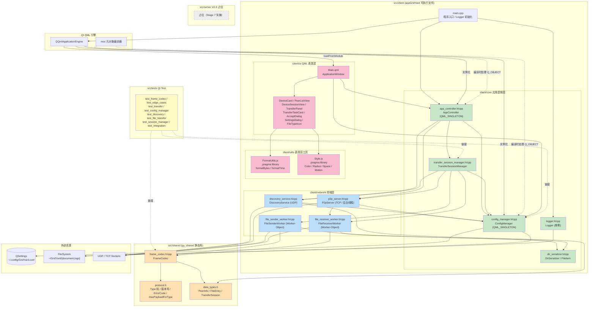

# GridYard 组件图（v4.16.0 当前架构）

按 `src/` 当前目录树与 CMake 目标划分组件，体现「共享静态库 + 客户端可执行文件 + 测试 + 服务端占位」四个构建单元，以及 Qt QML 引擎与外部资源的关系。

## 构建单元与模块职责

| 构建单元 | 路径 | CMake 目标 | 职责 |
|:---|:---|:---|:---|
| 共享静态库 | `src/shared/` | `gy_shared` | 客户端 + V2.0 服务端共用：TLV 协议、Type 码、ErrorCode、FrameCodec、PeerInfo/FileEntry/TransferSession POD |
| 客户端可执行文件 | `src/client/` | `appGridYard` | QML + C++ 桌面客户端，包含 core / network / utils / ui 四个子目录 |
| 服务端占位 | `src/server/` | （Stage 7） | V2.0 登录鉴权、对话历史漫游、离线消息暂存 |
| 单元测试 | `src/tests/` | `gy_tests` | Qt Test 框架，8 个测试可执行文件覆盖协议、配置、发现、传输、会话与集成 |

## 四层架构颜色对照

| 颜色 | 层 | 关键组件 |
|:---|:---|:---|
| 橙色 | 共享层（领域层基础） | protocol.h / data_types.h / frame_codec |
| 绿色 | 应用逻辑层 | AppController / ConfigManager / TransferSessionManager / DirSerializer / Logger |
| 蓝色 | 领域层（网络与传输） | DiscoveryService / P2pServer / FileSenderWorker / FileReceiverWorker |
| 粉色 | 表现层 | Main.qml / 8 个 QML 子组件 / FormatUtils.js |
| 黄色 | 测试 | 8 个 Qt Test 可执行文件 |
| 灰色虚线 | 占位 | V2.0 服务端（Stage 7 才实施） |
