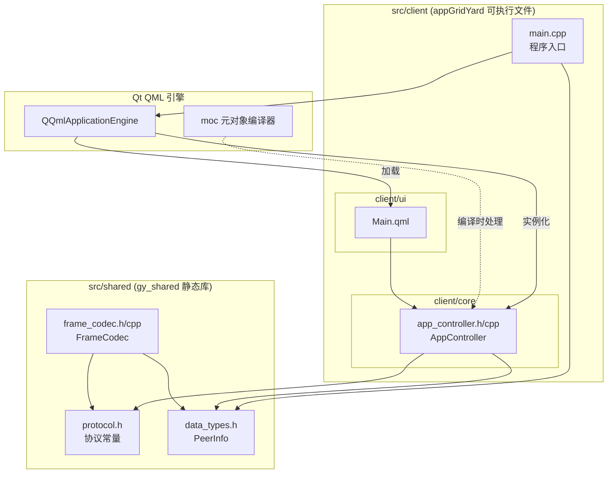

# GridYard 组件图（Stage 0 当前状态）

## 模块职责

| 模块 | 路径 | 职责 |
|:-----|:-----|:-----|
| gy_shared | src/shared/ | 客户端 + V2.0 服务端共用静态库 |
| appGridYard | src/client/ | 桌面客户端可执行文件 |
| Qt QML 引擎 | Qt 框架 | 加载 QML、实例化 C++ 单例 |
