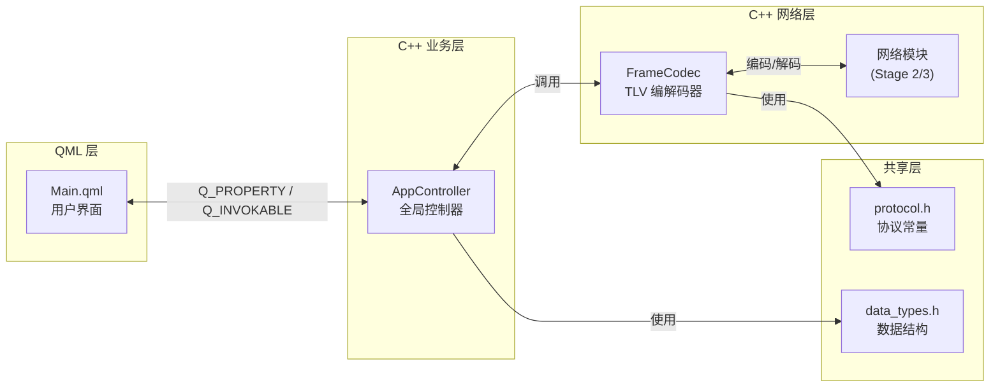

# GridYard 数据流图（Stage 0 当前状态）

## 数据流向说明

1. **QML ↔ AppController**：通过 Q_PROPERTY 读属性、Q_INVOKABLE 调方法
2. **AppController ↔ FrameCodec**：业务层调用编解码器
3. **FrameCodec ↔ 网络模块**：编码后发送、接收后解码（Stage 2/3 实现）
4. **FrameCodec → protocol.h**：使用协议常量（Type 码等）
5. **AppController → data_types.h**：使用数据结构（PeerInfo 等）
