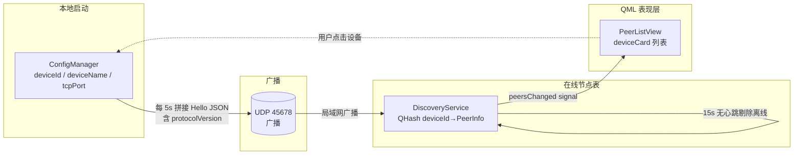
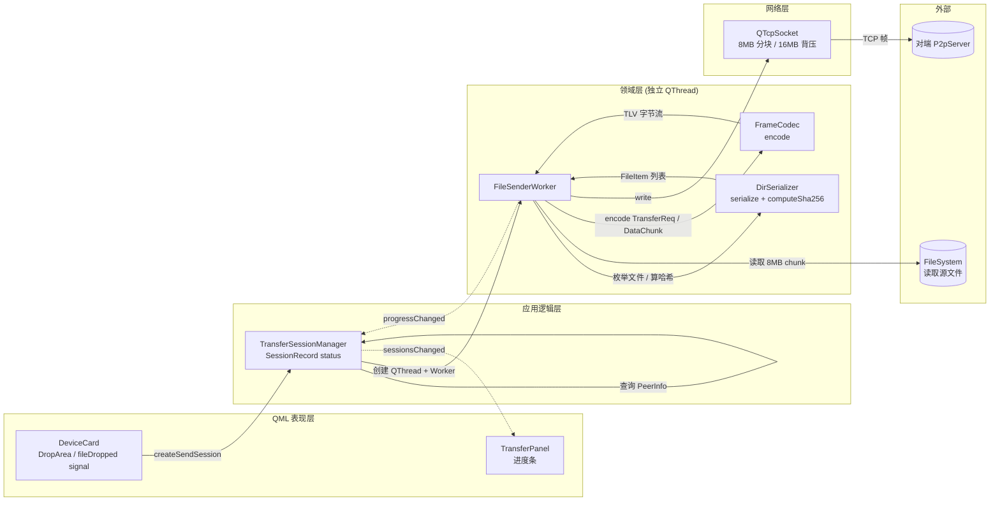
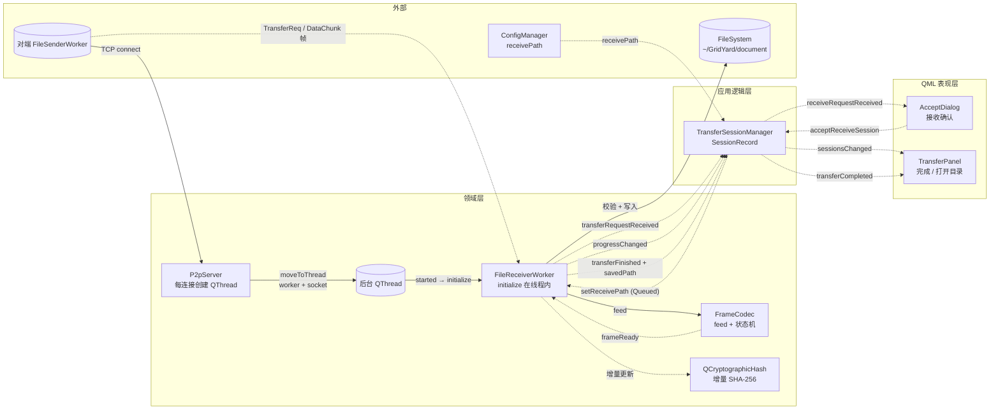
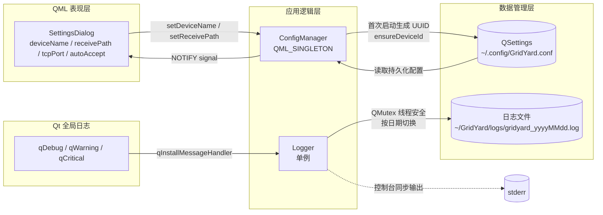
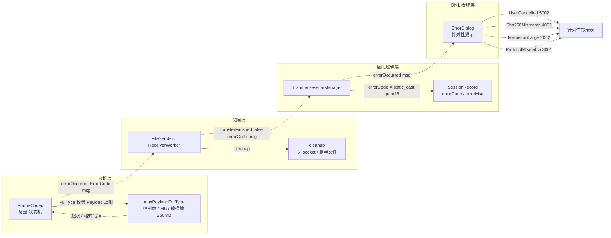

# GridYard 数据流图（v4.16.0 当前架构）

按 5 条独立数据流组织，每条流标注数据载体、跨层边界与协议契约。底部汇总协议错误处理流，覆盖 Stage 4 收尾引入的 ErrorCode 链路。

---

## 1. 设备发现流（UDP Hello ↔ DiscoveryService）

数据契约：Hello 包 JSON 含 `deviceId`、`deviceName`、`ipAddress`、`tcpPort`、`protocolVersion`。`PeerInfo::protocolVersion` 用于版本协商：主版本号一致才接受会话，次版本差异允许安全降级。

---

## 2. 文件发送流（QML 拖拽 → 对端 TCP）

发送链路的三段协议：`kTypeTransferReq`（JSON 元数据 + SHA-256）、`kTypeDataChunk`（8MB 二进制分块）、`kTypeTransferDone`（全部发送完成）。发送方按 `kMaxQueuedBytes = 16MB` 限制 Qt socket 写队列，避免大型文件一次性堆积到内存。

---

## 3. 文件接收流（TCP 入站 → 落盘）

接收侧关键边界：所有 TCP I/O、文件写入、SHA-256 计算都在后台线程执行；`TransferSessionManager` 通过 `QMetaObject::invokeMethod(worker, ..., Qt::QueuedConnection)` 跨线程调用 `acceptTransfer / rejectTransfer / setReceivePath`，避免直接操作 worker 内部状态。

---

## 4. 配置与日志流

`ConfigManager` 通过 `s_instance` 静态 `QPointer` 保证 QML 单例与 C++ 内部引用同一对象，避免出现两个实例导致信号失效。`Logger` 使用 `qInstallMessageHandler` 拦截所有 Qt 日志输出，业务代码用 `qDebug() << "[模块]" ...` 即可同时输出到控制台与按日期命名的日志文件。

---

## 5. 协议错误处理流（Stage 4 收尾引入）

错误码分级（V1.0 协议错误码体系）：

| 段位 | 类别 | 典型错误 |
|:---|:---|:---|
| 1xxx | 连接错误 | 1001 ConnectionTimeout / 1002 ConnectionLost / 1003 TransferTimeout |
| 2xxx | 帧格式错误 | 2001 InvalidFrame / 2002 FrameTooLarge / 2003 InvalidPayload |
| 3xxx | 协议契约错误 | 3001 ProtocolMismatch / 3002 InvalidFileName / 3003 InvalidFilePath / 3004 FileListMismatch |
| 4xxx | 磁盘 I/O 错误 | 4001 DiskWriteFailed / 4002 DiskSpaceInsufficient / 4003 Sha256Mismatch |
| 5xxx | 用户行为 | 5001 UserRejected / 5002 UserCancelled |
| 9xxx | 兜底 | 9999 UnknownError |
