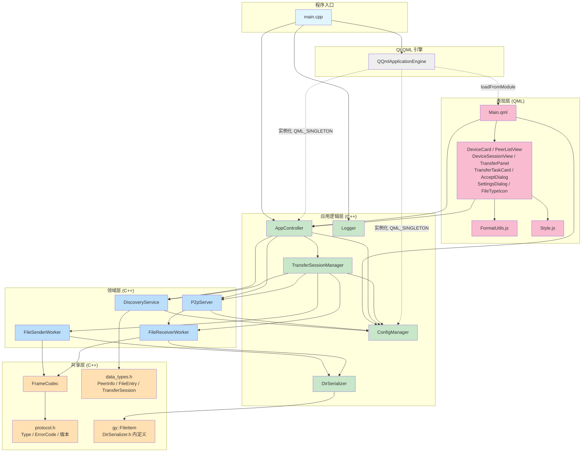

# GridYard 模块依赖关系图（v4.16.0 当前架构）

按 `#include` 真实依赖绘制，颜色对应四层架构。所有依赖方向均为「上层 → 下层」或「同层互引」，无环依赖。

## 颜色对照

| 颜色 | 层 | 关键模块 | 职责 |
|:---|:---|:---|:---|
| 蓝色 | 程序入口 | `main.cpp` | QGuiApplication + Logger 初始化 + 加载 QML |
| 粉色 | 表现层 | QML 文件 + FormatUtils.js | 页面、绑定、无状态展示计算 |
| 绿色 | 应用逻辑层 | AppController / ConfigManager / TransferSessionManager / DirSerializer / Logger | 组装对象、配置、会话生命周期、序列化与日志 |
| 蓝色（深） | 领域层 | DiscoveryService / P2pServer / Workers | UDP 发现、TCP 入站、文件收发 |
| 橙色 | 共享层 | FrameCodec / protocol.h / data_types.h / FileItem | TLV 协议、Type 码、ErrorCode、POD |
| 灰色 | Qt QML 引擎 | QQmlApplicationEngine | 加载 QML、实例化 C++ 单例 |

## 依赖方向约束

- **自上而下**：表现层 → 应用逻辑层 → 领域层 → 共享层，禁止反向依赖。
- **共享层零依赖**：`protocol.h` 只依赖 `<QtGlobal>`；`data_types.h` 只依赖 Qt 头；`frame_codec.h` 依赖 `protocol.h`。
- **应用逻辑层不直接操作网络**：`TransferSessionManager` 通过 `P2pServer` 与 `Workers` 间接访问 TCP，本身不持有 socket。
- **领域层不感知 QML**：所有领域类（DiscoveryService 除外，带 `QML_ANONYMOUS` 标记）不暴露给 QML，仅通过 `AppController` 与 `TransferSessionManager` 中转。
- **Worker 之间不互引**：`FileSenderWorker` 与 `FileReceiverWorker` 没有直接 `#include`，协议交互通过 FrameCodec 与 TCP 帧完成。

## 同层互引明细

| 调用方 | 被调用方 | 用途 |
|:---|:---|:---|
| AppController | ConfigManager | 获取全局实例 |
| AppController | DiscoveryService / P2pServer / TransferSessionManager | 创建并持有 |
| TransferSessionManager | ConfigManager | 读取 deviceId / deviceName / receivePath / autoAcceptFiles |
| TransferSessionManager | DiscoveryService | 查询目标设备 PeerInfo |
| TransferSessionManager | P2pServer | 订阅入站 transferRequestReceived |
| TransferSessionManager | FileSenderWorker / FileReceiverWorker | 创建 worker、连接信号、跨线程 invoke |
| P2pServer | FileReceiverWorker | 为每个入站连接创建 worker 实例 |
| DiscoveryService | ConfigManager | 读取本机身份与端口 |
| FileSenderWorker / FileReceiverWorker | DirSerializer | 枚举文件与计算 SHA-256（共享 FileItem 定义） |
| FileSenderWorker / FileReceiverWorker | FrameCodec | TLV 编解码 |
