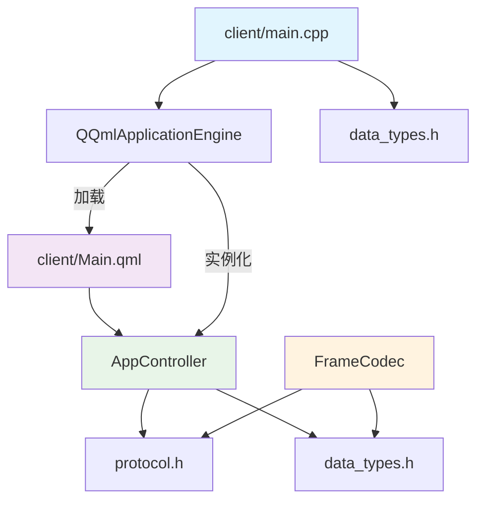

# GridYard 模块依赖关系图

## 颜色说明

| 颜色 | 模块 | 说明 |
|:-----|:-----|:-----|
| 蓝色 | main.cpp | 程序入口 |
| 紫色 | Main.qml | QML 用户界面 |
| 绿色 | AppController | C++ 业务控制器 |
| 橙色 | FrameCodec | TLV 编解码器 |

## 依赖方向

- **自上而下**：上层模块依赖下层模块
- **共享层**：protocol.h 和 data_types.h 被多个模块引用
- **QML 引擎**：负责加载 QML 和实例化 C++ 单例
