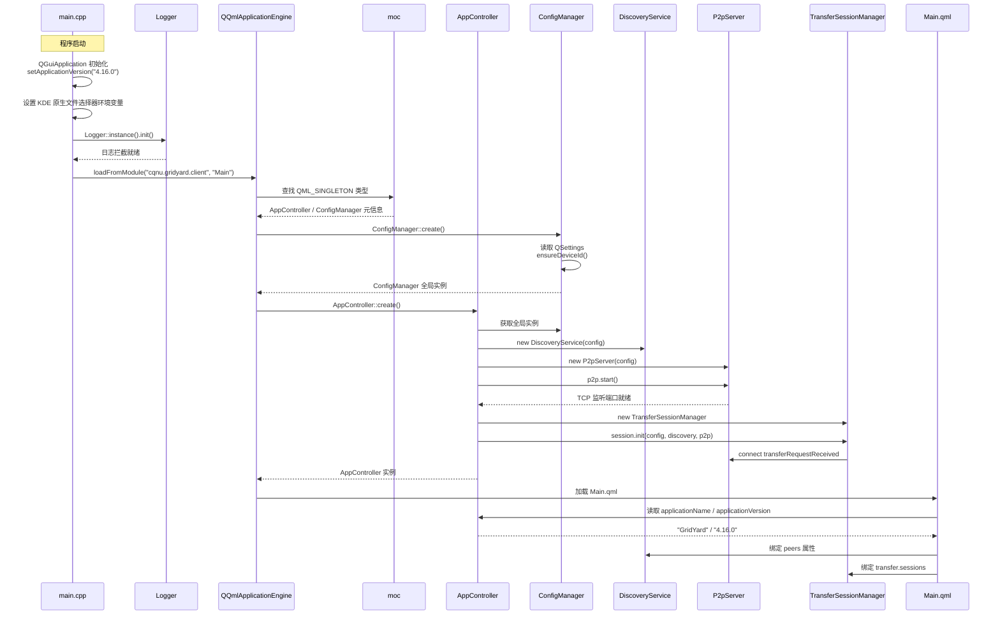
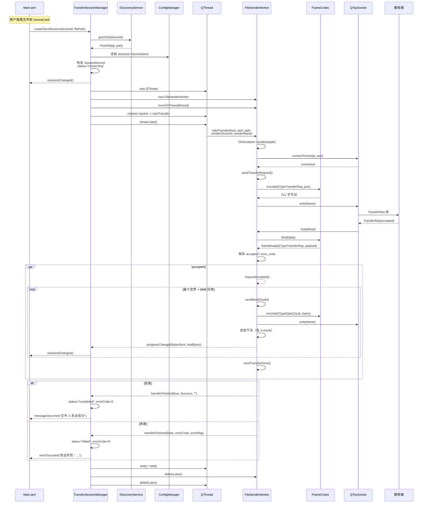
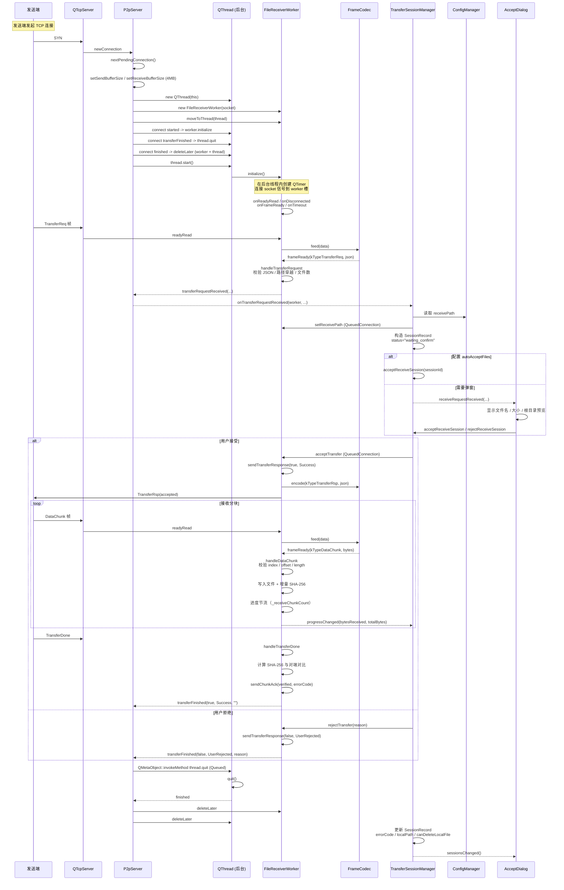
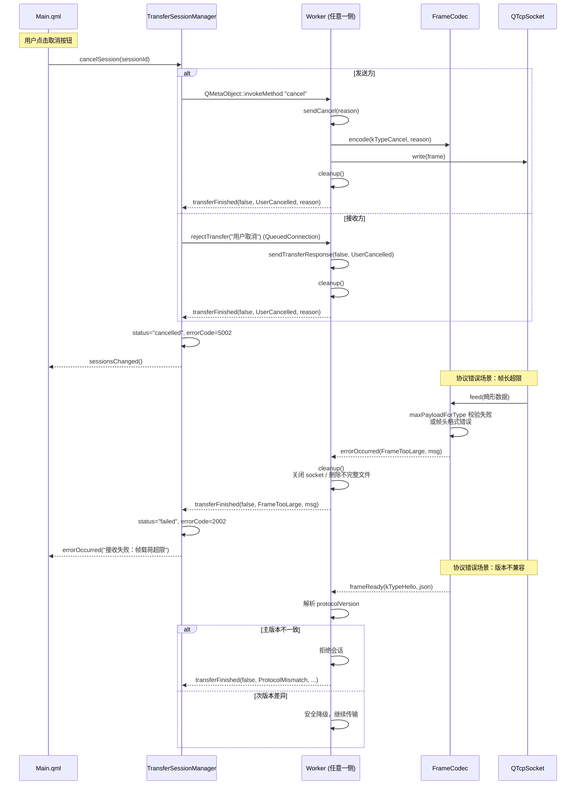

# GridYard C++↔QML 通信序列图（v4.16.0 当前架构）

按四个核心场景拆分序列图：应用启动初始化、文件发送、文件接收（含后台线程模型）、取消与协议错误处理。每个序列图标注跨线程边界与 Q_PROPERTY / Q_INVOKABLE 调用方向。

---

## 1. 应用启动初始化

启动顺序的关键约束：`ConfigManager` 通过静态 `QPointer` 实现真单例，保证 QML 引擎工厂创建的实例与 `AppController::_config` 引用的是同一对象；`P2pServer` 必须在 `TransferSessionManager.init()` 之前 `start()`，否则 `connect` 时端口未监听。

---

## 2. 文件发送时序

发送侧线程模型：`TransferSessionManager` 在主线程构造 `SessionRecord`，但 `FileSenderWorker` 与 `QTcpSocket` 全部 `moveToThread` 到独立 `QThread`。`transferFinished` 通过 Queued Connection 回到主线程更新模型，避免 QML 绑定与 worker 线程竞争。

---

## 3. 文件接收时序（含后台线程模型）

接收侧后台线程模型的关键点：

1. `P2pServer::onNewConnection()` 在主线程触发，但所有重活都委派给后台线程。
2. `FileReceiverWorker::initialize()` 必须在 worker 所在线程内执行——`QTimer` 与 socket 信号连接属于线程亲和性资源，在主线程创建会跨线程触发槽函数导致崩溃。
3. worker + socket 一起 `moveToThread`，确保所有 TCP I/O 与文件写入都不阻塞 UI。
4. `QThread` 父对象设为 `P2pServer`，析构时通过 `children()` 统一 `quit() / wait()`。

---

## 4. 取消与协议错误处理

错误码统一通过 `transferFinished(bool, ErrorCode, QString)` 三参数信号上报，`SessionRecord` 持久化 `errorCode` 字段供 QML 区分场景：

| ErrorCode | 含义 | 触发场景 |
|:---|:---|:---|
| 1002 ConnectionLost | 连接断开 | TCP 连接被对端关闭或网络中断 |
| 1003 TransferTimeout | 传输超时 | 30s 内无任何数据收发 |
| 2002 FrameTooLarge | 帧载荷超限 | 控制帧超过 1MB，或 DataChunk 超过 256MB |
| 3001 ProtocolMismatch | 协议版本不匹配 | Hello 包主版本号与本地不一致 |
| 4003 Sha256Mismatch | 校验失败 | 接收完成后哈希与发送端不一致 |
| 5001 UserRejected | 用户拒绝 | 接收确认弹窗点击「拒绝」 |
| 5002 UserCancelled | 用户取消 | 发送 / 接收方主动点击「取消」 |
