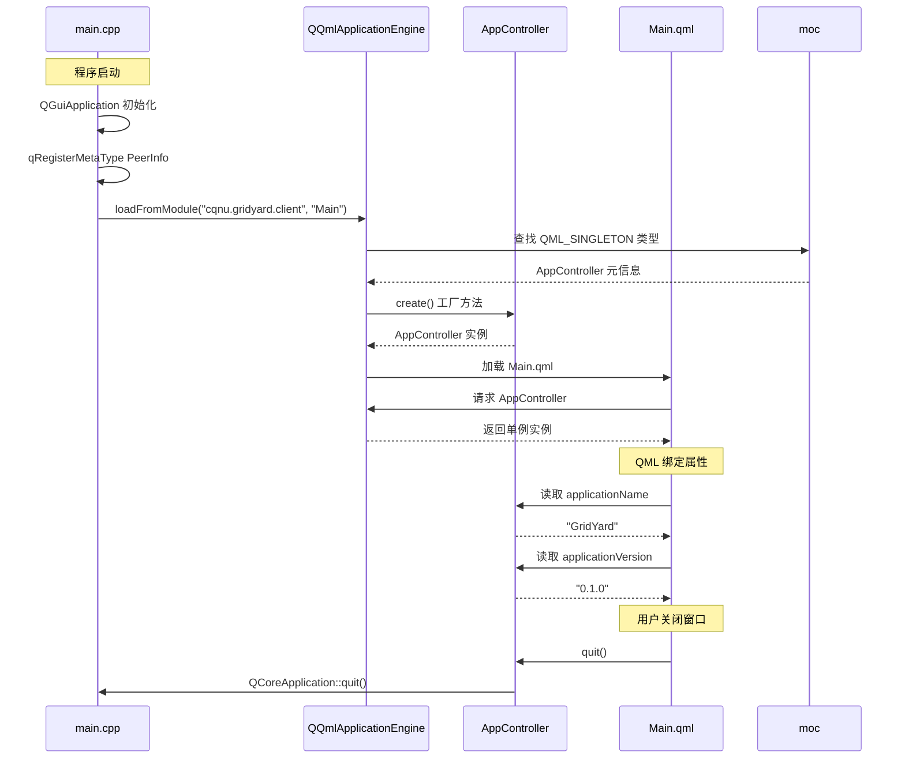

# GridYard C++↔QML 通信序列图

## 通信方式

| 方向 | 方式 | 示例 |
|:-----|:-----|:-----|
| C++ → QML | Q_PROPERTY 属性 | AppController.applicationName |
| QML → C++ | Q_INVOKABLE 方法 | AppController.quit() |
| C++ → QML | 信号（signals） | appReady() 信号 |
