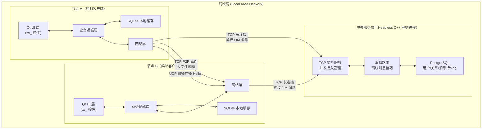

# 鸽邮 (GridYard) — 技术需求与系统设计规格说明书

---

| 字段       | 内容                          |
| :--------- | :---------------------------- |
| 文档版本   | v1.0                          |
| 创建日期   | 2026-04-23                    |
| 项目负责人 | 冯春霖                        |
| 核心成员   | 高扬 / 杜若贤 / 冯春霖        |
| 文档状态   | 草稿                          |
| 开发平台   | Manjaro Linux                 |
| 语言标准   | C++23 / Qt 框架（头文件机制） |

---

## 目录

1. [项目背景与定位](#1-项目背景与定位)
2. [竞品分析](#2-竞品分析)
3. [功能性需求](#3-功能性需求)
4. [非功能性需求](#4-非功能性需求)
5. [系统架构设计](#5-系统架构设计)
6. [技术栈选型与约束说明](#6-技术栈选型与约束说明)
7. [应用层通信协议规格](#7-应用层通信协议规格)
8. [关键技术攻关方案](#8-关键技术攻关方案)
9. [开发路线图与团队分工](#9-开发路线图与团队分工)
10. [V2.0 架构升级演进规划](#10-v20-架构升级演进规划)

---

## 1. 项目背景与定位

### 1.1 背景与痛点

在高校实验室、机房和宿舍等场景中，师生团队频繁面临以下典型痛点：

- 互传数 GB 的虚拟机镜像、深度学习数据集或工程代码时，受制于公网云服务器的带宽限速，传输效率极低；
- 现有的局域网工具（如飞鸽传书）缺乏账号体系，无法做到离线消息漫游，沟通上下文容易丢失；
- 主流即时通讯工具（微信、QQ）对校园内网并无优化，数据须绕道公网，存在带宽浪费与隐私顾虑。

### 1.2 项目定位

"鸽邮 (GridYard)"是一款专为校园局域网环境设计的综合协同终端，旨在将**高速文件直传**与**可靠即时通讯**融合于同一个桌面应用内，提供一站式的内网协同体验。

项目名称蕴含明确的架构隐喻：

- **"鸽"（G）— P2P 直连层**：象征去中心化、点对点的高速直传特性。如飞鸽传书般直达目标节点，不经任何公网中转，完整榨取千兆局域网或 Wi-Fi 6 的物理带宽上限。
- **"邮"（Y）— C/S 服务层**：象征中央服务端作为"邮局"的调度与托管职能，负责用户鉴权、状态维护与离线消息的可靠暂存投递，确保协作上下文持久可追溯。

### 1.3 整体架构模型

"鸽邮"采用**混合架构（Hybrid Architecture）**，在同一套系统中融合两种成熟的网络范式：

- **P2P 模式**（参考 LocalSend）：用于局域网内的零配置设备发现与超高速大文件直传，两端之间建立直接的 TCP 通道，不经服务端中转。
- **C/S 模式**（经典客户端/服务端）：用于统一身份认证、在线状态同步与离线消息漫游，弥补纯 P2P 架构无法应对"接收方离线"这一根本业务盲区。

---

## 2. 竞品分析

### 2.1 主要竞品对比

| 竞品                          | 核心优势                         | 核心痛点                                           | 鸽邮的差异化突破                                   |
| :---------------------------- | :------------------------------- | :------------------------------------------------- | :------------------------------------------------- |
| 飞鸽传书 / IP Messenger       | 纯 P2P，无需服务端，极致轻量     | 无账号体系，不支持离线漫游，换机记录丢失           | C/S 架构接管关系链与离线数据，记录跨设备可追溯       |
| QQ / 微信                     | UI 成熟，用户粘性高              | 强依赖外网，文件传输受云端带宽限速，消耗校园流量   | 直接在内网 TCP 层传输，带宽不受公网瓶颈限制         |
| LocalSend / 互传              | 跨平台免配置，局域网广播发现设备 | 纯文件快递功能，零社交属性，无即时通讯能力         | 将高并发文件 I/O 与低延迟文本通信深度融合于一个终端 |

### 2.2 鸽邮的优劣势剖析

**核心优势：**

1. **数据私有化**：全程在内网环境运行，数据不出机房，对内部技术资料共享具有较高的安全保障。
2. **架构可扩展**：基于 PostgreSQL 的关系型数据库设计，未来可以较低成本扩展权限管理、全局公告、文件云盘等特性。
3. **通道独立**：独立的二进制文件传输通道与文本消息通道相互隔离，大文件传输不影响文字通讯的实时性。

**劣势与挑战：**

1. **部署门槛较高**：需要一台常开的 Linux 节点（如 Manjaro 主机）作为中心服务端，并需预先配置数据库依赖，相比纯 P2P 工具失去了"随走随用"的便携性。
2. **并发规模有限**：作为学生团队的初期项目，服务端并发模型尚未经过大规模压测优化，面对全校级的同时在线请求时的稳定性与商业产品尚有差距。

---

## 3. 功能性需求

### 3.1 P2P 局域网文件传输子系统

| 编号  | 需求名称           | 详细描述                                                                                     | 优先级 |
| :---- | :----------------- | :------------------------------------------------------------------------------------------- | :----- |
| F-101 | 零配置设备发现     | 设备接入局域网后，无需手动输入 IP，系统自动广播并感知同一网段内运行"鸽邮"的其他节点         | 高     |
| F-102 | 动态节点路由表维护 | 实时更新并展示局域网内可用节点的在线/离线状态、设备名称及类型标识                           | 高     |
| F-103 | P2P 高速直传       | 发送方与接收方之间建立直接 TCP 连接，不经服务端中转，最大化利用局域网带宽                   | 高     |
| F-104 | 多类型传输支持     | 支持单文件、多文件批量以及含多层级子目录的完整文件夹结构传输                                | 高     |
| F-105 | 传输鉴权           | 接收方需在收到传输请求后明确执行"接受"或"拒绝"操作，禁止文件静默写入                       | 高     |
| F-106 | 任务生命周期控制   | 支持对进行中的传输任务执行暂停、恢复、取消操作                                               | 中     |
| F-107 | 实时传输反馈       | 在 UI 中实时展示传输速度（MB/s）、已完成百分比进度条与预估剩余时间                          | 中     |
| F-108 | 拖拽发起传输       | 支持将本地文件或文件夹拖拽至目标设备节点图标上，快速发起传输请求                            | 低     |

### 3.2 C/S 局域网即时通讯子系统

| 编号  | 需求名称           | 详细描述                                                                                     | 优先级 |
| :---- | :----------------- | :------------------------------------------------------------------------------------------- | :----- |
| F-201 | 账号注册与登录     | 提供基于局域网中央服务端的用户注册和登录鉴权功能                                             | 高     |
| F-202 | 在线状态同步       | 登录后实时同步并展示好友及群组成员的在线/离线状态                                           | 高     |
| F-203 | 单聊消息收发       | 支持向局域网内的指定用户发送和接收文本消息，具备毫秒级延迟的即时响应                        | 高     |
| F-204 | 群组聊天           | 支持创建群组（如宿舍群、项目组），在群组内进行多人文本消息广播                               | 中     |
| F-205 | 离线消息漫游       | 当接收方不在线时，服务端暂存消息；接收方上线后，自动从服务端拉取期间所有的离线未读消息       | 高     |
| F-206 | 本地历史记录缓存   | 客户端将已收到的消息持久化到本地 SQLite，断网状态下仍可正常查阅历史记录                      | 高     |
| F-207 | 系统通知           | 收到新消息或传输请求时，通过系统托盘（System Tray）弹出气泡通知，支持声音提醒                | 中     |

---

## 4. 非功能性需求

| 编号   | 类别           | 指标                                                                                                   |
| :----- | :------------- | :----------------------------------------------------------------------------------------------------- |
| NF-101 | 吞吐量         | P2P 传输会话在千兆局域网环境下，目标吞吐速率不低于 80 MB/s，力争达到 100 MB/s                        |
| NF-102 | 界面响应性     | 任何耗时 I/O 操作（文件读写、网络请求）严禁在 Qt 主线程中执行，确保界面始终保持响应状态               |
| NF-103 | 资源占用       | 客户端在后台驻留时，CPU 占用率应低于 1%，内存占用应控制于合理范围内，避免影响宿主机的使用             |
| NF-201 | 可靠性         | 大文件传输需支持断点续传；传输完成后必须对所有落盘文件执行 SHA-256 哈希校验，确保数据完整性           |
| NF-202 | 消息一致性     | C/S 的消息通道需具备 ACK 确认机制，确保消息不丢失、不重复、不乱序                                     |
| NF-203 | 容错与自愈     | 网络波动或连接中断时，系统应具备自动重连机制；节点 IP 因 DHCP 变化时，系统能及时感知并更新路由表     |
| NF-301 | 网络适应性     | 需适应 DHCP 动态分配 IP 的网络环境；若校园网存在跨子网路由，可降级为服务端信令辅助中转               |
| NF-401 | 架构解耦性     | 服务端程序与客户端程序必须为两套独立的可执行工程；UI 层对象与业务逻辑层对象的代码边界必须清晰可辨    |

---

## 5. 系统架构设计

### 5.1 总体架构图



### 5.2 数据流说明

**P2P 文件传输流程：**

```
发送端 UDP 广播 Hello
    -> 接收端回应，双端获知对方 IP
    -> 发送端主动连接接收端监听的 TCP 端口
    -> 发送文件元数据帧（名称、大小、目录树结构）
    -> 接收端鉴权确认 -> 接受 / 拒绝
    -> 接受：发送端开启分块传输，接收端持续确认写入
    -> 传输完成：接收端执行 SHA-256 校验并回报结果
```

**C/S 离线消息漫游流程：**

```
发送端 -> TCP 连接服务端 -> 服务端判断接收方状态
    -> 若在线：服务端实时推送至接收端
    -> 若离线：服务端将消息写入 PostgreSQL 离线消息表
接收端上线 -> TCP 鉴权连接服务端
    -> 服务端查询离线消息表 -> 批量下发所有未读消息
    -> 接收端写入本地 SQLite -> UI 层按时间轴渲染
```

---

## 6. 技术栈选型与约束说明

### 6.1 开发环境

| 环境项目         | 具体配置                                                    |
| :--------------- | :---------------------------------------------------------- |
| 操作系统         | Manjaro Linux（开发、编译、部署统一此环境）                 |
| 构建系统         | CMake                                                       |
| C++ 语言标准     | C++23                                                       |
| Qt 模块交互方式  | 强制使用传统 `#include` 头文件机制（原因见下方约束声明）    |

> **[重要约束] C++23 模块化与 Qt MOC 兼容性说明**
>
> Qt 框架的核心依赖元对象编译器（MOC）。当前版本的 MOC 对 C++23 Module 语法
> （`import std;` 等）的解析支持极为薄弱，在含 `Q_OBJECT` 宏的类文件中使用
> Module 语法将直接引发编译失败。
>
> **决策**：所有涉及 Qt 框架的代码文件（客户端全部代码）强制回退到传统头文件
> 预处理机制。仅在完全独立、不与 Qt 模块产生任何交叉依赖的纯逻辑计算库中，
> 可视情况尝试使用 C++23 模块化特性。

### 6.2 核心技术选型

| 层次             | 选型                              | 职责说明                                                     |
| :--------------- | :-------------------------------- | :----------------------------------------------------------- |
| GUI 框架         | Qt Widgets / Qt Designer          | 构建全部客户端 UI，提供事件循环与信号/槽机制                 |
| 多线程           | `QThread` + Worker Object 模式    | 将所有阻塞 I/O 操作隔离至独立后台线程，保证主线程响应不卡顿 |
| 设备发现（UDP）  | `QUdpSocket` + `QNetworkInterface` | 局域网组播/广播发现在线节点                                   |
| 数据传输（TCP）  | `QTcpServer` + `QTcpSocket`       | C/S 长连接消息通道 & P2P 文件直传通道                        |
| 数据序列化       | `QDataStream` + `QByteArray`      | 负责统一大小端对齐，实现跨平台安全的二进制协议帧编解码       |
| 服务端数据库     | PostgreSQL + 原生 C++ 客户端库    | 全局用户与消息持久化，处理高并发写入                         |
| 客户端数据库     | SQLite（通过 `QSqlDatabase`）      | 本地聊天记录缓存，支持断网查阅历史                           |
| 文件 I/O         | C++23 `<filesystem>` / `QFile`    | 目录遍历、分块读写、哈希计算                                 |
| 定时器           | `QTimer`                          | 心跳包定时广播与在线节点超时剔除                             |
| 系统集成         | `QSystemTrayIcon`                 | 后台驻留、系统通知气泡                                       |

### 6.3 UI 控件命名强制规范

> **[强制规范] `tw_` 前缀命名约定**
>
> 所有在 Qt Designer 中创建并由对象树管理的 UI 控件对象，命名时**必须**以 `tw_` 为前缀。
> 此规范旨在实现视图层（View）与逻辑层（Logic）的命名空间隔离，杜绝控件对象与普通业务变量在代码中产生混淆。
>
> **示例**（合规命名）：
> - `tw_BtnSend` — 发送按钮
> - `tw_ProgressBar_Transfer` — 文件传输进度条
> - `tw_ListPeers` — 局域网在线节点列表
> - `tw_ChatDisplay` — 聊天记录展示区
> - `tw_EditInput` — 消息输入框

---

## 7. 应用层通信协议规格

由于 TCP 是无边界的字节流协议，需在应用层自定义帧格式以解决粘包与半包问题。

### 7.1 帧结构定义（TLV 变长协议）

每个协议帧由**固定长度的 8 字节帧头**与**变长载荷体**组成：

```
 0               1               2               3
 0 1 2 3 4 5 6 7 0 1 2 3 4 5 6 7 0 1 2 3 4 5 6 7 0 1 2 3 4 5 6 7
+-+-+-+-+-+-+-+-+-+-+-+-+-+-+-+-+-+-+-+-+-+-+-+-+-+-+-+-+-+-+-+-+
|                         Type (4 Bytes)                        |
+-+-+-+-+-+-+-+-+-+-+-+-+-+-+-+-+-+-+-+-+-+-+-+-+-+-+-+-+-+-+-+-+
|                        Length (4 Bytes)                       |
+-+-+-+-+-+-+-+-+-+-+-+-+-+-+-+-+-+-+-+-+-+-+-+-+-+-+-+-+-+-+-+-+
|                    Payload (Length Bytes)                     |
|                            ...                                |
+-+-+-+-+-+-+-+-+-+-+-+-+-+-+-+-+-+-+-+-+-+-+-+-+-+-+-+-+-+-+-+-+
```

| 字段    | 长度    | 类型     | 说明                                   |
| :------ | :------ | :------- | :------------------------------------- |
| Type    | 4 字节  | uint32_t | 指令类型码，标识此帧的业务含义         |
| Length  | 4 字节  | uint32_t | Payload 的字节长度 N                   |
| Payload | N 字节  | byte[]   | 实际载荷，可为 JSON 字符串或二进制数据 |

### 7.2 指令类型码（Type）定义

| 类型码（十六进制） | 常量名称                | 说明                         | 载荷格式       |
| :----------------- | :---------------------- | :--------------------------- | :------------- |
| `0x0001`           | `TYPE_LOGIN_REQ`        | 客户端登录请求               | JSON           |
| `0x0002`           | `TYPE_LOGIN_RSP`        | 服务端登录响应               | JSON           |
| `0x0010`           | `TYPE_HEARTBEAT`        | 心跳保活包                   | 空（Length=0） |
| `0x0011`           | `TYPE_ONLINE_STATUS`    | 节点在线状态推送             | JSON           |
| `0x0020`           | `TYPE_MSG_SEND`         | C/S 单聊消息发送             | JSON           |
| `0x0021`           | `TYPE_MSG_RECV`         | C/S 消息下发（推送）         | JSON           |
| `0x0022`           | `TYPE_MSG_ACK`          | 消息已送达确认               | JSON           |
| `0x0030`           | `TYPE_OFFLINE_PULL_REQ` | 请求拉取离线消息             | JSON           |
| `0x0031`           | `TYPE_OFFLINE_PULL_RSP` | 离线消息批量下发             | JSON           |
| `0x0100`           | `TYPE_P2P_HELLO`        | UDP 节点发现广播包           | JSON           |
| `0x0101`           | `TYPE_P2P_META`         | P2P 文件/目录元数据帧        | JSON           |
| `0x0102`           | `TYPE_P2P_META_ACK`     | 接收端对文件元数据的鉴权响应 | JSON           |
| `0x0103`           | `TYPE_P2P_DATA_CHUNK`   | P2P 文件数据分块帧           | 二进制         |
| `0x0104`           | `TYPE_P2P_DATA_ACK`     | 分块接收确认                 | JSON           |
| `0x0105`           | `TYPE_P2P_VERIFY`       | 传输完成哈希校验报告         | JSON           |

---

## 8. 关键技术攻关方案

### 8.1 零配置设备发现（UDP 组播）

**问题本质**：在多网卡（同时连接有线局域网和 WiFi）的主机上，若向错误的网卡接口发送广播，其他设备将无法收到。

**解决方案**：

1. 在发送广播前，使用 `QNetworkInterface::allInterfaces()` 遍历主机全部网卡。
2. 过滤出状态为 UP、类型为以太网或 WiFi、具有合法 IPv4 地址的网卡。
3. 向每一个有效网卡对应子网的广播地址（如 `192.168.1.255`）定向发送 UDP Hello 包。
4. 维护一个 `QMap<QString, QDateTime>` 结构的节点时间戳表，由 `QTimer` 每 5 秒触发一次扫描，将超过 15 秒未更新心跳的节点标记为离线并从列表移除。

### 8.2 TCP 粘包处理（状态机接收缓冲区）

**问题本质**：TCP 是字节流协议，多次 `write()` 的数据可能在接收端被合并为一次 `readyRead()` 信号，也可能在一次 `readyRead()` 中只收到半帧数据。

**解决方案** — 接收端实现如下两状态的读取状态机：

```
[状态 S0: 等待帧头]
  -> 循环从 socket 读取数据追加至接收缓冲区
  -> 若缓冲区长度 >= 8 字节：
       解析 Type 和 Length，进入 [状态 S1]

[状态 S1: 等待完整 Payload]
  -> 继续从 socket 追加数据至缓冲区
  -> 若缓冲区长度 >= 8 + Length：
       截取完整的一帧交付业务层处理
       从缓冲区头部移除已处理的 8 + Length 字节
       返回 [状态 S0] 处理残留数据（处理粘包情形）
```

所有字节操作使用 `QByteArray` + `QDataStream` 处理，由 `QDataStream` 保证网络字节序（大端序）的正确性。

### 8.3 异步文件 I/O 与 UI 线程防阻塞

**问题本质**：在 Qt 主线程（即 UI 线程）中直接进行大文件的磁盘读写，会导致事件循环无法处理绘制和输入事件，表现为界面卡死（"未响应"）。

**解决方案** — 采用 Worker Object 模式进行线程隔离：

```
主线程（UI 线程）
    |--- 创建 QThread + FileTransferWorker 对象
    |--- worker->moveToThread(thread)
    |--- 通过 Signal 向 worker 发送传输指令（Queued Connection）
    |--- 接收 worker 发来的 progressChanged(int) 信号 -> 更新 tw_ProgressBar_Transfer
    |--- 接收 worker 发来的 transferFinished(bool) 信号 -> 更新 UI 状态

后台线程（FileTransferWorker）
    |--- 以固定 Chunk Size（如 4 MB）循环读取本地文件
    |--- 将每个数据块封装为 TYPE_P2P_DATA_CHUNK 帧写入 TCP Socket
    |--- 计算并发射 progressChanged(int percent) 信号
```

**分块 I/O 伪代码逻辑（禁止使用 readAll()）**：

```cpp
constexpr qint64 CHUNK_SIZE = 4 * 1024 * 1024; // 4 MB
QFile file(filePath);
file.open(QIODevice::ReadOnly);
qint64 totalBytes = file.size();
qint64 sentBytes  = 0;

while (!file.atEnd()) {
    QByteArray chunk = file.read(CHUNK_SIZE);
    sendDataFrame(chunk);        // 封装 TLV 帧并写入 TCP Socket
    sentBytes += chunk.size();
    int percent = static_cast<int>(sentBytes * 100 / totalBytes);
    emit progressChanged(percent); // 跨线程安全，由 Qt Queued Connection 机制保障
}
```

**进阶优化（可选）**：探索使用 `QFileDevice::map()` 实现文件内存映射（mmap），以减少内核态与用户态之间的数据复制次数，突破分块读写的 I/O 瓶颈，进一步提升大文件传输吞吐速率。

---

## 9. 开发路线图与团队分工

### 9.1 成员角色定义

| 成员   | 核心技能定位                                           | 主要职责域                             |
| :----- | :----------------------------------------------------- | :------------------------------------- |
| 高扬   | 服务端架构、网络底层、多线程、数据库；有 C/S 网盘经验 | 中心服务端全部开发、客户端网络底层引擎 |
| 杜若贤 | Qt 框架学习中                                          | 客户端 Qt UI 设计与控件交互逻辑        |
| 冯春霖 | Qt 框架学习中                                          | 客户端本地存储、业务数据组装与胶水层   |

### 9.2 四阶段路线图

#### Phase 1 — 基础设施搭建（目标：统一规范，跑通最小 Demo）

| 任务                                       | 负责人 | 产出物                                          |
| :----------------------------------------- | :----- | :---------------------------------------------- |
| 设计 TLV 通信协议帧结构与全部 Type 码定义  | 高扬   | 协议头文件（`protocol.h`）                      |
| 搭建 CMake 多目标工程（client / server）   | 高扬   | 项目根 `CMakeLists.txt`                         |
| 启动 PostgreSQL，建立用户表与消息表 Schema | 高扬   | 数据库初始化 SQL 脚本                           |
| Qt 客户端主工程搭建，划分模块目录结构      | 杜若贤 | 客户端工程框架                                  |
| Qt Designer 绘制主界面、登录界面骨架      | 杜若贤 | `.ui` 文件（所有控件严格遵守 `tw_` 命名规范）  |
| 封装 `LocalDbManager` SQLite 辅助单例类    | 冯春霖 | `local_db_manager.h/.cpp`                       |
| 编写 C++23 `<filesystem>` 目录遍历工具函数 | 冯春霖 | `file_utils.h/.cpp`                             |

#### Phase 2 — 核心通信（目标：设备互相发现，C/S 鉴权跑通）

| 任务                                           | 负责人 | 产出物                                     |
| :--------------------------------------------- | :----- | :----------------------------------------- |
| 实现 UDP 广播发送与多网卡 IP 筛选              | 高扬   | `DiscoveryService` 类                      |
| 实现服务端 TCP 并发监听与客户端会话管理        | 高扬   | `ClientSession` 类                        |
| 实现客户端登录/注册协议帧的发送与响应解析      | 冯春霖 | `AuthManager` 类                           |
| 实现节点在线状态上报与服务端推送解析           | 冯春霖 | `StatusManager` 类                         |
| 将在线节点数据渲染至 `tw_ListPeers` 控件       | 杜若贤 | 节点列表 UI 逻辑                           |
| 实现登录界面的完整网络交互与结果反馈 UI        | 杜若贤 | 登录模块 UI 逻辑                           |

#### Phase 3 — P2P 大文件传输（目标：局域网高速直传跑通，带进度反馈）

| 任务                                                       | 负责人 | 产出物                            |
| :--------------------------------------------------------- | :----- | :-------------------------------- |
| 实现客户端内嵌 P2P TCP 监听服务                           | 高扬   | `P2pServer` 类                    |
| 实现基于 `QThread` Worker 模式的分块文件发送引擎           | 高扬   | `FileSenderWorker` 类             |
| 实现目录树结构到 JSON 元数据帧的序列化与反序列化           | 冯春霖 | `DirSerializer` 类                |
| 实现传输进度计算算子，发射 `progressChanged` 信号          | 冯春霖 | 集成于 `FileSenderWorker`         |
| 实现 Qt Drag & Drop 拖拽捕获，提取文件路径后发起传输请求   | 杜若贤 | 节点列表拖拽 UI 逻辑              |
| 将进度信号连接至 `tw_ProgressBar_Transfer`，实现暂停/取消  | 杜若贤 | 传输面板 UI 逻辑                  |

#### Phase 4 — C/S 漫游与系统联调（目标：离线漫游跑通，系统整体联测）

| 任务                                                       | 负责人   | 产出物                             |
| :--------------------------------------------------------- | :------- | :--------------------------------- |
| 实现服务端离线消息信箱读写逻辑（存入/查询/下发/清除）      | 高扬     | 服务端 `OfflineMailbox` 模块       |
| 实现服务端异常断连检测与资源清理机制                       | 高扬     | 会话心跳超时处理逻辑               |
| 实现客户端上线后拉取漫游消息，写入本地 SQLite             | 冯春霖   | `RoamingSyncManager` 类            |
| 提供按时间轴排序的历史消息 SQLite 查询接口                 | 冯春霖   | `LocalDbManager` 查询接口扩展      |
| 实现聊天界面的气泡消息渲染（区分发件方与收件方）           | 杜若贤   | `tw_ChatDisplay` 消息渲染逻辑      |
| 实现 `QSystemTrayIcon` 后台驻留与新消息气泡弹窗通知        | 杜若贤   | 系统托盘模块                       |
| 全员：局域网多机压力测试（含断网、强退等异常场景测试）     | 全员     | 测试报告                           |

---

## 10. V2.0 架构升级演进规划 (Future Work)

### 10.1 演进动机与设计原则

V1.0 以纯 P2P 架构实现了快速有效的局域网文件传输，但其去中心化特性从根本上限制了以下能力：

- **离线投递不可能**：目标节点不在线时，消息无处暂存，只能丢弃。
- **持久身份不存在**：节点以 IP + 设备名标识，换机后历史上下文全部丢失。
- **群体协同无支点**：无中心节点无法实现局域网聊天大厅或广播通知。

V2.0 的演进目标是**在完全不破坏 V1.0 已有 P2P 传输能力的前提下**，以"热插拔"的方式为系统接入一个独立的 C/S 服务端，实现上述三项能力补全。

核心设计原则如下：
- **客户端代码零重构**：V1.0 中封装的 `DiscoveryService`、`FileSenderWorker`、`FileReceiverWorker` 等类保持不变。仅在客户端新增一个 `ServerLink` 连接管理模块，负责与新服务端通信。
- **服务端职责边界清晰**：服务端**永远不参与文件传输**，文件数据始终走 P2P TCP 直连通道。服务端仅处理身份鉴权、在线状态同步、IM 消息路由和离线消息暂存四件事。
- **协议向下兼容**：V2.0 新增的 Type 码段（`0x1000` 以上）不与 V1.0 的 Type 码产生任何冲突，旧版客户端可忽略未知 Type 码并继续正常工作。

---

### 10.2 网络流向变化：V1.0 vs V2.0

#### V1.0 网络流向（纯 P2P）

```
局域网内所有节点地位完全对等，唯一的流量类型为：
广播发现 + P2P 文件直传

节点 A                                       节点 B
  |                                             |
  |  -------- UDP 广播 Hello (45678) -------->  |
  |  <------- UDP 广播 Hello (45678) ---------  |
  |                                             |
  |  (用户在 A 拖拽文件至 B 的设备卡片)          |
  |                                             |
  |  ======== TCP 直连 (B 的 tcp_port) ======>  |
  |  ------- TYPE_TRANSFER_REQ (握手) ------->  |
  |  <------ TYPE_TRANSFER_RSP (接受) --------  |
  |  ------- TYPE_DATA_CHUNK * N (数据) ----->  |
  |  <------ TYPE_CHUNK_ACK (校验完成) -------  |
  |  ======== TCP 连接关闭 ==================>  |
  |                                             |

特点：B 不在线时，A 无法向 B 传递任何信息。
```

#### V2.0 网络流向（P2P 保留 + C/S 叠加）

```
新增一个常开的中心服务端节点 S，独立部署于局域网某台主机。
P2P 文件传输通道完全不变；服务端仅承载 IM 与鉴权流量。

节点 A          中心服务端 S (GridYard-Server)          节点 B
  |                       |                             |
  |  == TCP 长连接 (登录) =>                             |
  |  -- TYPE_LOGIN_REQ -->|                             |
  |  <-- TYPE_LOGIN_RSP --|                             |
  |                       |<== TCP 长连接 (登录) ==     |
  |                       |<-- TYPE_LOGIN_REQ --        |
  |                       |--- TYPE_LOGIN_RSP -->       |
  |                       |                             |
  |  (B 此刻离线，A 向 B 发消息)                        |
  |                       |                             |
  |  -- TYPE_MSG_SEND --> |                             |
  |                       | [查询 B 状态: 离线]          |
  |                       | [写入 PostgreSQL 离线表]    |
  |                       |                             |
  |                       |  (次日 B 上线，建立连接)    |
  |                       |<== TCP 长连接 (登录) ==     |
  |                       | [查询 B 的离线消息]         |
  |                       |-- TYPE_OFFLINE_PULL_RSP --> |
  |                       |                             |
  |  (同时，A 仍然可以向在线的 B 直传大文件，不经过 S)  |
  |                                                     |
  |  ============= TCP P2P 直连 (文件传输) ==========>  |
  |  (此通道与服务端 S 无任何关系，流量完全绕过 S)       |
  |  ================================================>  |
  |                                                     |

关键区别：
  文件流量  -> 走 P2P TCP 直连（与 V1.0 完全相同，S 不参与）
  IM 消息   -> 经由 S 路由转发或离线暂存
  设备发现  -> UDP 广播（与 V1.0 相同）+ S 的在线表作兜底
```

---

### 10.3 新增的独立服务端（GridYard-Server）

#### 10.3.1 程序形态

`GridYard-Server` 是一个**无图形界面（Headless）的 C++ 守护进程**，独立编译为单独的可执行文件，与客户端共用同一个 CMake 工程下的不同 target。

```
项目工程结构（V2.0）

GridYard/
├── client/           # V1.0 已有，不改动
│   ├── network/
│   ├── ui/
│   └── core/
├── server/           # V2.0 新增
│   ├── main.cpp              # 守护进程入口，epoll 事件循环
│   ├── client_session.h/.cpp # 每个 TCP 连接的会话对象
│   ├── msg_router.h/.cpp     # 消息路由：在线投递 / 离线暂存
│   ├── offline_mailbox.h/.cpp# PostgreSQL 离线消息读写
│   └── db_pool.h/.cpp        # PostgreSQL 连接池（libpqxx）
└── shared/           # 双端共用
    └── protocol.h            # Type 码定义（V1.0 + V2.0 扩展码）
```

#### 10.3.2 PostgreSQL 数据库设计（helloword 库）

数据库名称指定为 `helloword`，初始 Schema 包含以下核心表：

```sql
-- 用户账户表
CREATE TABLE users (
    user_id     SERIAL PRIMARY KEY,
    username    VARCHAR(64) UNIQUE NOT NULL,
    pwd_hash    CHAR(64) NOT NULL,          -- SHA-256 哈希
    device_name VARCHAR(128),
    last_seen   TIMESTAMPTZ DEFAULT NOW()
);

-- 离线消息表（信箱模型）
CREATE TABLE offline_messages (
    msg_id      BIGSERIAL PRIMARY KEY,
    sender_id   INT REFERENCES users(user_id),
    receiver_id INT REFERENCES users(user_id),
    content     TEXT NOT NULL,
    sent_at     TIMESTAMPTZ DEFAULT NOW(),
    delivered   BOOLEAN DEFAULT FALSE       -- 投递后标记，由定时清理任务删除
);

-- 聊天大厅消息表（公共频道）
CREATE TABLE lobby_messages (
    msg_id      BIGSERIAL PRIMARY KEY,
    sender_id   INT REFERENCES users(user_id),
    content     TEXT NOT NULL,
    sent_at     TIMESTAMPTZ DEFAULT NOW()
);
```

#### 10.3.3 服务端高并发模型

服务端需对外同时维护数十至数百条 TCP 长连接。采用如下模型处理并发：

- **I/O 事件驱动**：基于 Linux `epoll` 或 Qt 的 `QAbstractSocket` 非阻塞模式，主线程事件循环监听所有客户端连接的可读事件，不为每个连接创建独立线程。
- **数据库操作异步化**：PostgreSQL 的读写操作（写入离线消息、查询漫游数据）统一委托给一个独立的数据库工作线程池（基于生产者-消费者队列），避免阻塞主事件循环。
- **连接池**：使用 `libpqxx` 维护一个固定大小的 PostgreSQL 连接池（建议初始值为 CPU 核数 × 2），避免每次数据库操作重新建立连接的开销。

---

### 10.4 客户端新增模块（平滑接入）

客户端仅需新增以下模块，已有代码无需改动：

| 新增模块              | 职责                                                                          |
| :-------------------- | :---------------------------------------------------------------------------- |
| `ServerLink`          | 维护与 GridYard-Server 的 TCP 长连接，处理登录、心跳、断线重连逻辑              |
| `ImManager`           | 封装单聊消息的发送（`TYPE_MSG_SEND`）与接收（`TYPE_MSG_RECV`）               |
| `LobbyManager`        | 封装聊天大厅的消息订阅与发布                                                  |
| `RoamingSyncManager`  | 登录后向服务端拉取离线消息（`TYPE_OFFLINE_PULL_REQ`），写入本地 SQLite        |
| `LocalDbManager`      | 在 V1.0 会话历史的基础上扩展 IM 聊天记录的 CRUD 接口                         |

新增 UI 界面（杜若贤负责）：

| 新增界面              | 说明                                                                          |
| :-------------------- | :---------------------------------------------------------------------------- |
| 登录/注册对话框       | 账号密码登录，首次使用时注册                                                  |
| 单聊会话界面          | 基于 `QTextBrowser` 的气泡式消息展示，区分发件方与收件方                      |
| 局域网聊天大厅        | 所有在线用户均可见的公共频道，类似 IRC 聊天室                                 |

---

### 10.5 V2.0 协议扩展码（向下兼容）

V2.0 新增 Type 码从 `0x1000` 起分配，不与 V1.0 的 `0x0001` ~ `0x0401` 段冲突：

| Type 码     | 常量名                  | 说明                         |
| :---------- | :---------------------- | :--------------------------- |
| `0x1001`    | `TYPE_LOGIN_REQ`        | 客户端登录请求               |
| `0x1002`    | `TYPE_LOGIN_RSP`        | 服务端登录响应               |
| `0x1003`    | `TYPE_REGISTER_REQ`     | 账号注册请求                 |
| `0x1004`    | `TYPE_REGISTER_RSP`     | 账号注册响应                 |
| `0x1010`    | `TYPE_SERVER_HEARTBEAT` | 客户端向服务端的 TCP 保活包  |
| `0x1011`    | `TYPE_ONLINE_STATUS`    | 服务端推送好友在线状态变更   |
| `0x1020`    | `TYPE_MSG_SEND`         | 客户端向服务端发送单聊消息   |
| `0x1021`    | `TYPE_MSG_RECV`         | 服务端向客户端投递单聊消息   |
| `0x1022`    | `TYPE_MSG_ACK`          | 消息送达确认                 |
| `0x1030`    | `TYPE_OFFLINE_PULL_REQ` | 客户端请求拉取离线消息       |
| `0x1031`    | `TYPE_OFFLINE_PULL_RSP` | 服务端批量下发离线消息       |
| `0x1040`    | `TYPE_LOBBY_SEND`       | 客户端向聊天大厅发送消息     |
| `0x1041`    | `TYPE_LOBBY_BROADCAST`  | 服务端广播大厅消息至所有在线客户端 |

---

*本文档由"鸽邮 (GridYard)"项目团队初稿整理，随开发进展持续更新。*
